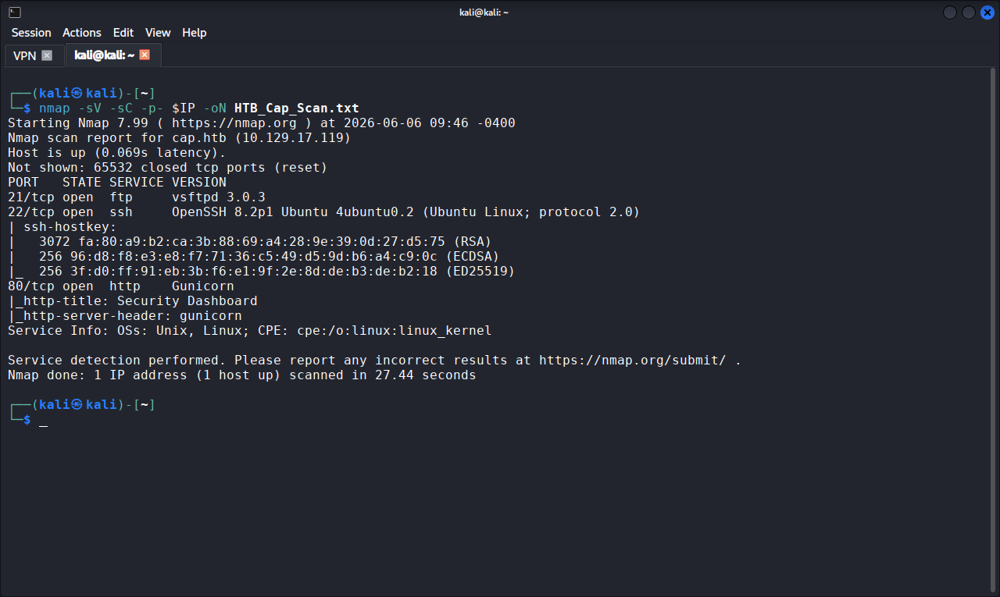
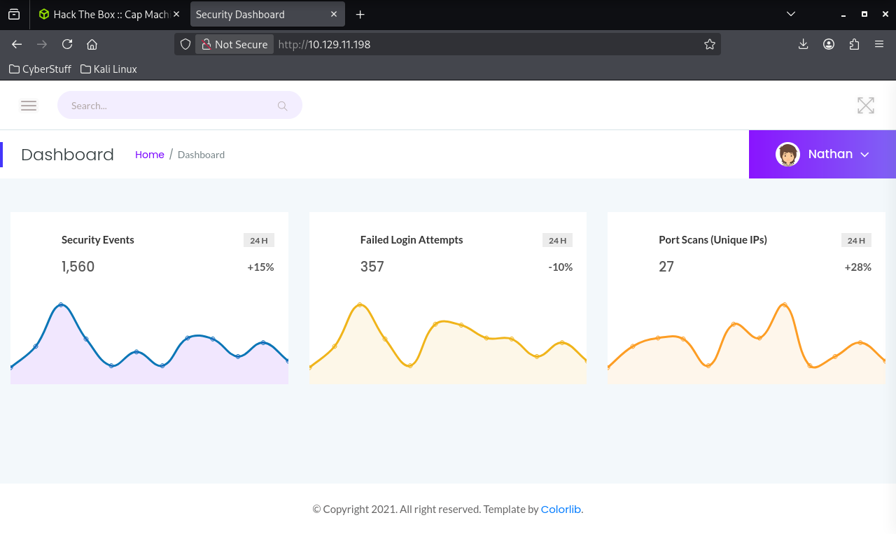
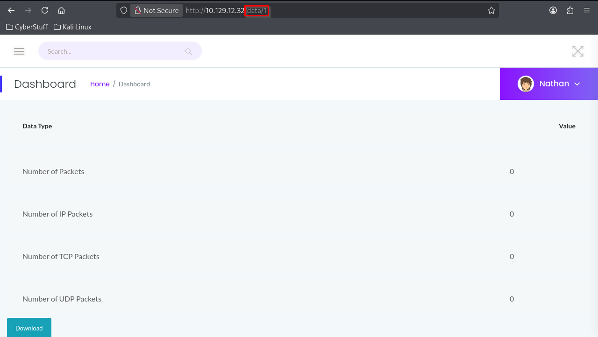
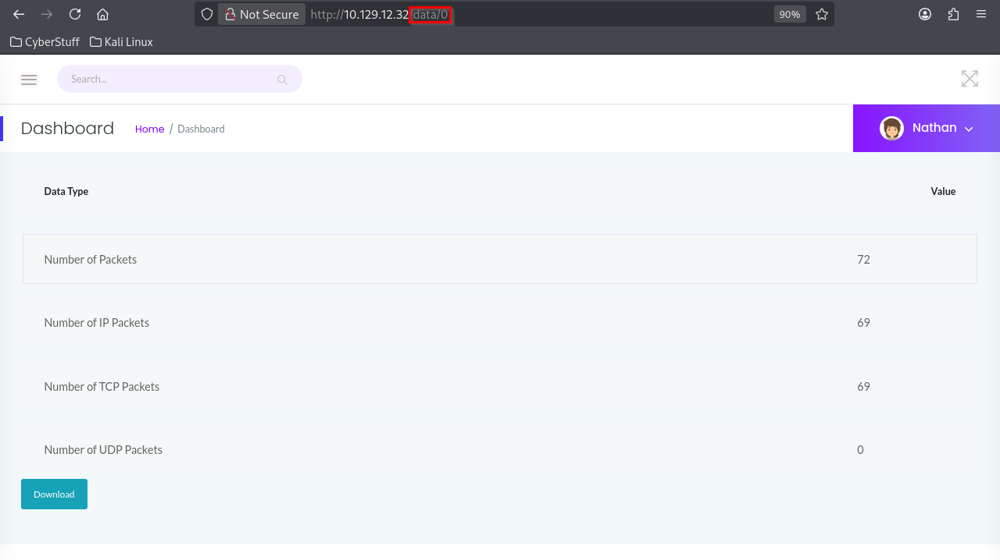
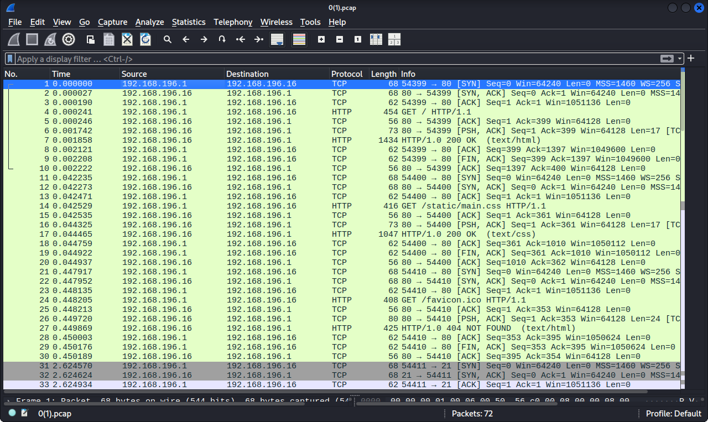
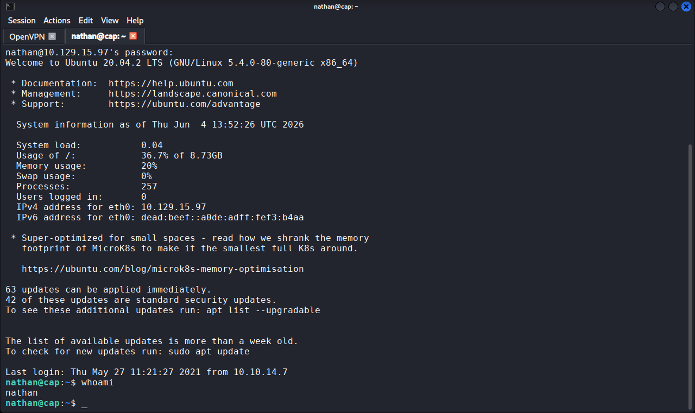
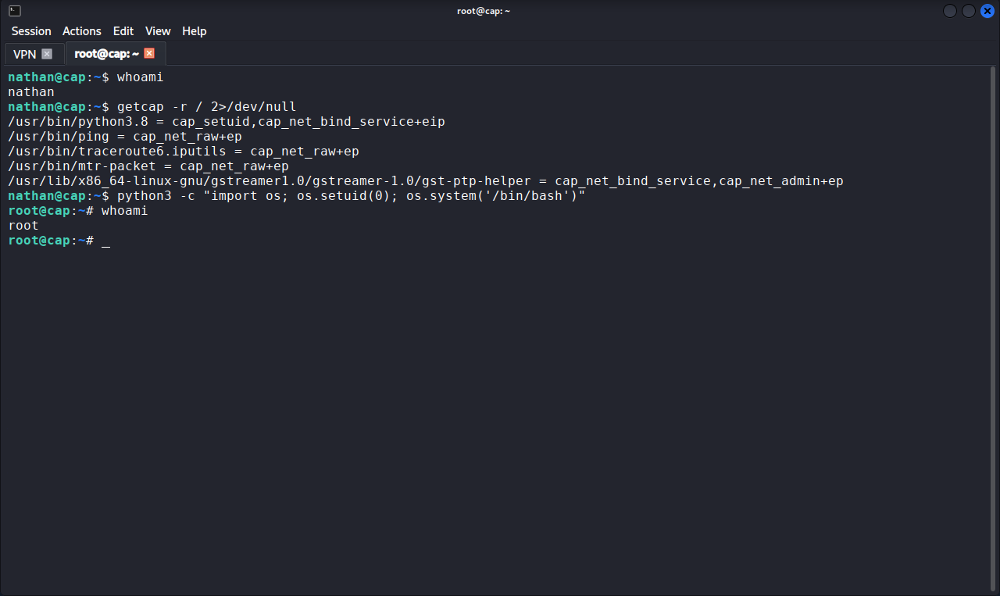

# HTB Cap: Walkthrough

## Machine Info

| Field          | Detail                       |
| -------------- | ---------------------------- |
| Platform       | Hack The Box                 |
| Machine        | Cap                          |
| Difficulty     | Easy                         |
| OS             | Linux (Ubuntu 20.04)         |
| IP             | 10.129.X.X                   |
| Status         | Retired                      |
| CVEs exploited | n/a (misconfigurations only) |

---

## Summary

Cap is an Easy Linux box that chains four weaknesses into a full compromise: a web dashboard exposes other users' network captures via an IDOR, one of those captures contains plaintext FTP credentials, the same password is reused for SSH, and a misconfigured Linux capability on the Python binary grants any local user root access. No CVEs are required; the entire chain exploits misconfigurations and poor credential hygiene.

---

## Step 1: Reconnaissance

**Objective:** identify open services and map the attack surface.

```bash
nmap -sV -sC -p- $IP -oN HTB_Cap_Scan.txt
```

| Port | Service | Version |
|------|---------|---------|
| 21 | FTP | vsftpd 3.0.3 |
| 22 | SSH | OpenSSH 8.2p1 |
| 80 | HTTP | gunicorn (Python) |

**What this told me:**
- Three services, all worth investigating. FTP is a cleartext protocol, so if credentials are in play it is immediately a finding. SSH provides a shell route if credentials are recovered. The gunicorn web server on 80 is the primary interactive surface and the logical starting point.

**Screenshot:** Figure 1:



---

## Step 2: Web Application Enumeration

**Objective:** understand the web application's features and identify potential vulnerabilities.

Browsing to `http://cap.htb/` presented a security dashboard with network statistics, active connections, and a "Security Snapshot" feature that generates downloadable PCAP files of captured network traffic.

**What this told me:**
- The dashboard is logged in as a user called "Nathan" (visible in the top-right corner). The Security Snapshot feature produces PCAP files, which could contain sensitive data if the captures record authentication traffic. The key question was: are other users' captures accessible?

**Screenshot:** Figure 2




---

## Step 3: Exploiting the IDOR Vulnerability

**Objective:** determine whether the application enforces access control on PCAP captures.

Clicking Security Snapshot navigated to a URL with a sequential numeric ID:

```
http://cap.htb/data/1
```

The page showed packet counts for the current capture (all zeroes, meaning no traffic was captured in this snapshot). Changing the ID to 0:

```
http://cap.htb/data/0
```

This returned a different capture belonging to another session, with 72 packets recorded. The application performed no authorisation check; it served the file based solely on the ID.

**What this told me:**
- This is a textbook IDOR (Insecure Direct Object Reference): the application uses predictable, sequential identifiers and never checks whether the requesting user owns the resource. The `/data/0` capture contained actual traffic (72 packets versus 0), which made it worth downloading and analysing. The download button retrieved the file as `0.pcap`.

**Screenshot:** Figures 3 and 4





---

## Step 4: PCAP Analysis and Credential Recovery

**Objective:** examine the captured traffic for sensitive data.

Opened the downloaded PCAP in Wireshark:

```bash
wireshark 0.pcap
```

Applied a display filter for FTP traffic:

```
ftp
```

This isolated 25 FTP packets showing a complete authentication exchange. Following the TCP stream (right-click a packet, Follow, TCP Stream) revealed the full conversation:

```
220 (vsFTPd 3.0.3)
USER nathan
331 Please specify the password.
PASS [REDACTED]
230 Login successful.
```

**What this told me:**
- FTP transmits credentials in plaintext. Anyone able to capture or access stored network traffic (as demonstrated via the IDOR) can read these credentials directly. The username `nathan` matched the dashboard user, and FTP was open on port 21. The next step was to test whether the password was reused on SSH, since password reuse across services is a common weakness.

**Screenshot:** Figures 5 and 6



.jpg)


---

## Step 5: SSH Access as Nathan

**Objective:** test the recovered FTP credentials against SSH.

```bash
ssh nathan@cap.htb
```

The FTP password worked for SSH, granting an interactive shell as `nathan`.

```bash
whoami
# nathan
```

User-level access was confirmed.

**What this told me:**
- Password reuse across FTP and SSH meant a single credential compromise gave interactive host access. This is the foothold. From here, the objective shifted to privilege escalation: what can `nathan` do or access that leads to root?

**Screenshot:** Figure 7




---

## Step 6: Privilege Escalation Enumeration

**Objective:** identify a path from `nathan` to root.

Standard Linux enumeration for privilege escalation. Checked sudo permissions first:

```bash
sudo -l
# nathan is not in the sudoers file
```

No sudo access. Checked for SUID binaries:

```bash
find / -perm -u=s -type f 2>/dev/null
```

Nothing unusual. Checked for Linux capabilities:

```bash
getcap -r / 2>/dev/null
```

```
/usr/bin/python3.8 = cap_setuid,cap_net_bind_service+eip
```

**What this told me:**
- `sudo -l` and SUID returned nothing interesting, which is normal on a well-configured system. But `getcap` revealed a critical misconfiguration: `python3.8` carries the `cap_setuid` capability with `+eip` (effective, inheritable, permitted). This means the Python binary can call `setuid(0)` to change its process UID to root, regardless of who runs it. Any local user with access to `python3.8` can become root. This is a well-documented privesc technique listed on GTFOBins.

---

## Step 7: Root via Capability Abuse

**Objective:** exploit the `cap_setuid` capability to escalate to root.

```bash
python3.8 -c "import os; os.setuid(0); os.system('/bin/bash')"
```

Breaking this down:
- `import os` loads the OS module
- `os.setuid(0)` uses the `cap_setuid` capability to change the process UID to 0 (root)
- `os.system('/bin/bash')` spawns a bash shell, now running as root

```bash
whoami
# root
```

Root access confirmed.

**What this told me:**
- The capability misconfiguration turned a low-privilege foothold into instant root. `cap_setuid` on a general-purpose interpreter (Python, Perl, Ruby) is effectively equivalent to full root access, because the interpreter can execute arbitrary code including UID changes. This is why capability auditing (`getcap -r /`) should be a standard step in every Linux privilege-escalation check, alongside `sudo -l` and SUID enumeration.

**Screenshot:** Figure 8



---
## Flags

| Flag | Method | Status |
|------|--------|--------|
| User | SSH as `nathan` using FTP credential recovered from PCAP via IDOR | [REDACTED] |
| Root | Python `cap_setuid` capability abuse | [REDACTED] |

---

## Tools Used

| Tool      | Purpose                                 |
| --------- | --------------------------------------- |
| nmap      | Port scanning and service enumeration   |
| Firefox   | Web application enumeration             |
| Wireshark | PCAP analysis and credential extraction |
| ssh       | Remote host access                      |
| getcap    | Linux capability enumeration            |
| python3.8 | Privilege-escalation vehicle            |

---
## Lessons Learned

1. Always test for IDOR on any endpoint that uses sequential or predictable identifiers. Changing `/data/1` to `/data/0` was a one-character change that exposed another user's sensitive data; this class of vulnerability is trivial to find and high-impact.
2. Never overlook `getcap` during Linux enumeration. It is easy to focus on `sudo -l` and SUID and forget capabilities, but `cap_setuid` on an interpreter is an instant root path that SUID checks will not find.
3. Password reuse is the connective tissue that turned a captured FTP credential into an SSH shell. A unique password on SSH would have broken the chain entirely, even with the IDOR and the cleartext FTP traffic.

---
## References

| Resource                       | URL                                                       |
| ------------------------------ | --------------------------------------------------------- |
| GTFOBins (Python capabilities) | https://gtfobins.github.io/gtfobins/python/               |
| Linux capabilities(7)          | https://man7.org/linux/man-pages/man7/capabilities.7.html |
| OWASP: IDOR                    | https://owasp.org/www-project-web-security-testing-guide/ |

---

*This walkthrough documents a retired Hack The Box machine completed in an authorised lab environment for educational purposes. Flags are redacted. No unauthorised systems were accessed.*
