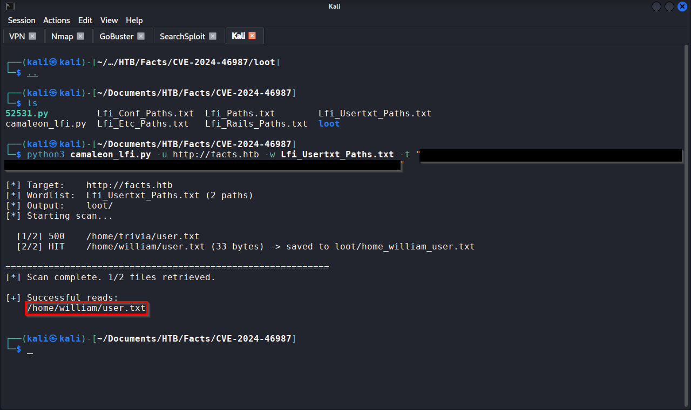
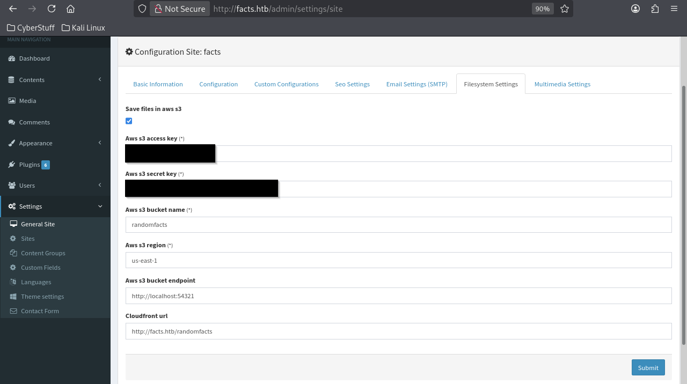

# Penetration Test Report: HTB Facts

## Document Control

| Field              | Detail                                                                       |
| ------------------ | ---------------------------------------------------------------------------- |
| Report title       | Penetration Test Report: HTB Facts                                           |
| Version            | 1.0                                                                          |
| Author             | David Lumsden                                                                |
| Reviewer (QA)      | Self-reviewed                                                                |
| Date               | 2026-06-14                                                                   |
| Classification     | Confidential / Training Documentation                                        |
| Distribution       | Portfolio (public)                                                           |
| Publication status | RETIRED, cleared for portfolio                                               |
| Redaction policy   | Flags withheld. Credentials, tokens, keys, and passphrases redacted in body. |

### Version history

| Version | Date | Author | Notes |
|---------|------|--------|-------|
| 1.0 | 2026-06-14 | David Lumsden | Initial report, v3 standard |

---

## Table of Contents

1. Executive Summary
2. Scope and Rules of Engagement
3. Methodology and Risk Rating Model
4. Attack Narrative
5. Findings Summary
6. Detailed Findings
7. Strategic Recommendations (Root-Cause Themes)
8. Remediation Roadmap
9. Proof of Exploitation
10. Retest and Validation
- Appendix A: Tools Used
- Appendix B: References

---

## 1. Executive Summary

An attacker with nothing more than a web browser could register an account on the organisation's public-facing website and, within minutes, take full administrative control of the server. The content-management system allowed any self-registered user to grant themselves administrator privileges through a flaw in how it processed account updates. From that elevated position, the attacker could read arbitrary files from the server using a known software vulnerability, recover storage credentials displayed in plaintext on the admin settings page, and use those credentials to access an internal backup containing a private SSH key. After cracking the key's password using a common credentials list, the attacker gained direct command-line access to the server. A misconfigured system tool then allowed escalation to full administrative ("root") control in a single step.

Every link in this chain exploited either a known, patchable vulnerability or a basic configuration weakness. No specialised tooling was required beyond freely available utilities.

Overall risk rating: CRITICAL

### Findings at a glance

| Severity | Count |
|----------|-------|
| Critical | 2 |
| High | 3 |
| Medium | 2 |
| Low | 1 |
| Informational | 0 |

Most urgent action: patch Camaleon CMS to a version that fixes CVE-2024-46987 and the mass-assignment flaw, and remove the facter sudo grant.

### Attack path summary

```
Self-registration on CMS
    |
    v
Mass-assignment privilege escalation (client -> admin)
    |
    v
CVE-2024-46987 (authenticated path traversal) -> /etc/passwd, SSH keys
    |                                            (automated with custom script)
    |
    v
MinIO credentials harvested from admin settings page
    |
    v
S3 bucket enumeration -> encrypted SSH private key recovered
    |
    v
Passphrase cracked (john + common wordlist) -> SSH as trivia  (USER FLAG)
    |
    v
sudo -l -> facter (ALL) NOPASSWD
    |
    v
Facter custom-fact injection -> root shell  (ROOT FLAG)
```

---

## 2. Scope and Rules of Engagement

| Item | Detail |
|------|--------|
| In scope | 10.129.244.96 (facts.htb) and all open services |
| Out of scope | HTB infrastructure, other platform users |
| Authorisation | Hack The Box; machine assigned to tester account |
| Testing type | Black-box (no prior credentials or source) |
| Testing window | Single session, 14 June 2026 |
| Constraints | No denial-of-service testing |

---

## 3. Methodology and Risk Rating Model

Testing was aligned to PTES and the OWASP Web Security Testing Guide, across reconnaissance, enumeration, vulnerability identification, exploitation, post-exploitation, and reporting.

Risk rating model: base severity uses CVSS v3.1 (vector per finding), labelled strictly by band (Critical 9.0 to 10.0, High 7.0 to 8.9, Medium 4.0 to 6.9, Low 0.1 to 3.9). A contextual Risk rating is derived from Likelihood multiplied by Business Impact. Note F-05 (facter sudo abuse): its CVSS base is High because the access vector is local, but its operational Risk is Critical because it yields root in a single step.

---

## 4. Attack Narrative

### Phase 1: Reconnaissance

An `nmap -sV -p-` scan identified three services (Figure 1):


| Port | Service | Version |
|------|---------|---------|
| 22/tcp | SSH | OpenSSH 9.9p1 Ubuntu |
| 80/tcp | HTTP | nginx 1.26.3 (Camaleon CMS v2.9.0, Ruby on Rails, Puma) |
| 54321/tcp | HTTP | Golang net/http (MinIO S3-compatible storage) |

Directory enumeration with Gobuster revealed `/admin` (302 redirect to `/admin/login`), confirming an authentication-gated admin panel. The `/up` endpoint (73 bytes) confirmed a Rails backend.


### Phase 2: CMS Access and Privilege Escalation (Mass Assignment)

The CMS allowed self-registration via the `/admin/login` signup form. A low-privilege ("client") account was created and used to log in to the admin dashboard. The CMS version was confirmed as Camaleon CMS v2.9.0 from the dashboard footer.

Profile update requests were intercepted and found to accept a `password[role]=admin` parameter appended to the POST body. The server failed to validate the role assignment server-side, allowing the self-registered client account to grant itself full administrator privileges (Figure 2). This is a mass-assignment (parameter-tampering) vulnerability.


### Phase 3: Path Traversal (CVE-2024-46987), Manual and Automated

With admin access, `searchsploit` identified CVE-2024-46987: an authenticated path traversal in Camaleon CMS v2.9.0 via `/admin/media/download_private_file`. The `auth_token` cookie was extracted from the browser.

Initial manual exploitation confirmed the vulnerability by reading `/etc/passwd`, which disclosed two real user accounts: `trivia` (UID 1000) and `william` (UID 1001) (Figure 3).


The original PoC script (ExploitDB 52531) required interactive, single-path input per execution, and a high proportion of guessed paths returned HTTP 500. To accelerate the process, a custom Python wrapper was developed (see `Camaleon_lfi.py` in this folder) that automates the traversal against a targeted wordlist (`Lfi_Paths.md`) and saves all HTTP 200 responses to a `loot/` directory. The wordlist was structured by category (system files, SSH keys, proc filesystem, Rails application paths across common deployment directories) based on the prior reconnaissance.

The automated scan recovered `/home/trivia/.ssh/authorized_keys` (Figure 4) and, notably, `/home/trivia/user.txt`, capturing the user flag via the path traversal rather than through an interactive shell. This was not the intended access path but demonstrates the severity of the file-read vulnerability: any file readable by the web-application user is exposed.



### Phase 4: Credential Harvesting and S3 Enumeration

The CMS admin panel's Filesystem Settings page displayed MinIO (S3-compatible) storage credentials in plaintext: an access key and a secret key (both redacted) (Figure 5). The MinIO endpoint on port 54321 was configured using the AWS CLI: 



```bash
aws configure --profile facts
aws --endpoint-url http://facts.htb:54321 s3 ls
```

Two buckets were discovered: `camaleon` (CMS media) and `internal`. The `internal` bucket contained a full home-directory backup for the `trivia` user, including an encrypted SSH private key (`id_ed25519`, ed25519, aes256-ctr/bcrypt) whose public component matched the `authorized_keys` entry recovered earlier (Figure 6).


### Phase 5: Key Cracking and SSH Access

The encrypted private key was downloaded and its hash extracted with `ssh2john`. Initial cracking with `rockyou.txt` projected approximately five days to complete due to bcrypt throttling (~26 passwords per second). Switching to `/usr/share/seclists/Passwords/Common-Credentials/10k-most-common.txt` recovered the passphrase (redacted) quickly (Figure 7).

SSH access as `trivia` was established using the cracked key.


### Phase 6: Privilege Escalation (Facter Sudo Abuse)

`sudo -l` revealed that `trivia` could run `/usr/bin/facter` as any user without a password. Facter is a Ruby-based system-information tool (part of the Puppet ecosystem) that supports loading custom facts (arbitrary Ruby code) from user-specified directories via `--custom-dir`. A malicious Ruby fact file was created and executed as root:

```bash
echo 'Facter.add("exploit") do setcode do system("/bin/bash") end end' > /tmp/exploit.rb
sudo /usr/bin/facter --custom-dir /tmp exploit
```

This yielded a root shell (Figure 8), completing the compromise.


---

## 5. Findings Summary

| ID | Finding | Severity | CVSS | Risk | CVE |
|----|---------|----------|------|------|-----|
| F-01 | Mass-assignment privilege escalation (client to admin) | Critical | 9.8 | Critical | n/a |
| F-02 | Authenticated path traversal (arbitrary file read) | Critical | 9.1 | Critical | CVE-2024-46987 |
| F-03 | Plaintext storage credentials in admin settings | High | 7.5 | High | n/a |
| F-04 | Sensitive data in S3 object storage (SSH private key) | High | 7.5 | High | n/a |
| F-05 | Insecure sudo configuration (facter, ALL NOPASSWD) | High | 7.8 | Critical | n/a |
| F-06 | Weak SSH key passphrase | Medium | 5.9 | Medium | n/a |
| F-07 | CMS allows open self-registration with admin-panel access | Medium | 5.3 | High | n/a |
| F-08 | Software version disclosure (CMS footer) | Low | n/a | Low | n/a |

---

## 6. Detailed Findings

### F-01: Mass-Assignment Privilege Escalation (Client to Admin)

| Field | Detail |
|-------|--------|
| Severity | Critical |
| CVSS v3.1 | `CVSS:3.1/AV:N/AC:L/PR:L/UI:N/S:U/C:H/I:H/A:H` = 9.8 |
| Likelihood | High |
| Business impact | High |
| Risk | Critical |
| CVE | n/a |
| Affected asset | Camaleon CMS v2.9.0, profile-update endpoint |
| Authentication required | Self-registered user (client role) |
| MITRE ATT&CK | T1548 (Abuse Elevation Control Mechanism) |

Description: the CMS profile-update endpoint accepts a `password[role]=admin` parameter in the POST body without server-side validation. Any authenticated user, including a self-registered client-level account, can grant themselves full administrator privileges by appending this parameter to a profile-update request.

Evidence: a self-registered client account was elevated to admin by submitting the modified POST request. The admin dashboard, including all settings pages, became accessible immediately.

Business impact: any visitor to the site can self-register and become a full CMS administrator, gaining access to all content, settings, storage credentials, and the attack surface for F-02.

Remediation: implement server-side role validation on all account-update endpoints; use a strong-parameters pattern (Rails `permit`) that explicitly excludes role assignment; restrict role changes to a dedicated super-admin function with separate authorisation.

References: OWASP A01:2021 (Broken Access Control); CWE-915 (Mass Assignment).

---

### F-02: Authenticated Path Traversal (Arbitrary File Read)

| Field | Detail |
|-------|--------|
| Severity | Critical |
| CVSS v3.1 | `CVSS:3.1/AV:N/AC:L/PR:L/UI:N/S:U/C:H/I:N/A:N` = 9.1 [verify on NVD] |
| Likelihood | High (authentication trivially met via F-01 or open registration) |
| Business impact | High |
| Risk | Critical |
| CVE | CVE-2024-46987 |
| Affected asset | Camaleon CMS v2.9.0, `/admin/media/download_private_file` |
| Authentication required | User (any authenticated CMS account) |
| MITRE ATT&CK | T1083 (File and Directory Discovery), T1552.004 (Unsecured Credentials: Private Keys) |

Description: the `file` parameter in `/admin/media/download_private_file` is not sanitised, allowing directory traversal (`../../`) to read any file on the server that is readable by the web-application process. Combined with F-01 (or open registration), any unauthenticated visitor can exploit this.

Evidence: automated exploitation using a custom Python wrapper (`Camaleon_lfi.py`) with a targeted wordlist recovered `/etc/passwd`, SSH authorised keys, the user flag, and other sensitive files. The user flag was captured via this path traversal rather than through an interactive shell (unintended path).

Business impact: arbitrary file read across the server; any credential, key, or configuration file readable by the web process is exposed.

Remediation: upgrade Camaleon CMS to a version that fixes CVE-2024-46987; implement path-canonicalisation and allowlisting on all file-download endpoints; restrict the web process to a chrooted or containerised filesystem where feasible.

References: CVE-2024-46987 (NVD); ExploitDB 52531.

---

### F-03: Plaintext Storage Credentials in Admin Settings

| Field | Detail |
|-------|--------|
| Severity | High |
| CVSS v3.1 | `CVSS:3.1/AV:N/AC:L/PR:H/UI:N/S:U/C:H/I:N/A:N` = 7.5 |
| Likelihood | High (admin access obtained via F-01) |
| Business impact | High |
| Risk | High |
| CVE | n/a |
| Affected asset | CMS Filesystem Settings page |
| Authentication required | Admin (trivially met via F-01) |
| MITRE ATT&CK | T1552.001 (Credentials in Files) |

Description: the admin settings page displayed the MinIO S3-compatible storage access key and secret key in plaintext. Any user with admin access (trivially obtainable via F-01) can read these credentials directly from the interface.

Evidence: access key and secret key visible on the Filesystem Settings page (values redacted).

Business impact: full access to the organisation's object-storage buckets, enabling data exfiltration and (in this case) recovery of a private SSH key from an internal backup.

Remediation: never display secret keys in the UI; mask or vault storage credentials; use IAM roles or instance profiles rather than static keys where possible; rotate the exposed keys immediately.

References: OWASP A05:2021 (Security Misconfiguration).

---

### F-04: Sensitive Data in S3 Object Storage (SSH Private Key)

| Field | Detail |
|-------|--------|
| Severity | High |
| CVSS v3.1 | `CVSS:3.1/AV:N/AC:L/PR:L/UI:N/S:U/C:H/I:H/A:N` = 7.5 |
| Likelihood | High |
| Business impact | High |
| Risk | High |
| CVE | n/a |
| Affected asset | MinIO `internal` bucket |
| Authentication required | Storage credentials (obtained via F-03) |
| MITRE ATT&CK | T1552.004 (Unsecured Credentials: Private Keys) |

Description: the `internal` S3 bucket contained a full home-directory backup for user `trivia`, including an encrypted SSH private key whose public component matched the authorised-keys entry on the host. The bucket was accessible using the credentials exposed in F-03.

Evidence: `aws s3 ls` enumerated the `internal` bucket; the private key was downloaded and its fingerprint matched the `authorized_keys` file recovered via F-02.

Business impact: recovery of the key, combined with passphrase cracking (F-06), granted interactive SSH access to the host.

Remediation: remove private keys and sensitive backups from object storage; restrict bucket access with least-privilege IAM policies; enable bucket-access logging and alerting.

References: OWASP A05:2021.

---

### F-05: Insecure Sudo Configuration (Facter, ALL NOPASSWD)

| Field | Detail |
|-------|--------|
| Severity | High (the local access vector caps the base score in the High band; see Risk) |
| CVSS v3.1 | `CVSS:3.1/AV:L/AC:L/PR:L/UI:N/S:U/C:H/I:H/A:H` = 7.8 |
| Likelihood | High (trivial once a shell is held) |
| Business impact | High |
| Risk | Critical (single-step path to root) |
| CVE | n/a |
| Affected asset | Sudo configuration, `/usr/bin/facter` |
| Authentication required | Local user (`trivia`) |
| MITRE ATT&CK | T1548.003 (Abuse Elevation Control Mechanism: Sudo), T1059.004 (Command and Scripting Interpreter: Unix Shell) |

Description: user `trivia` can execute `/usr/bin/facter` as any user (including root) without a password. Facter supports loading custom facts (arbitrary Ruby code) from user-specified directories via `--custom-dir`. A malicious Ruby file executed through this mechanism runs as root.

Evidence: `sudo -l` confirmed the grant; a custom fact file containing `system("/bin/bash")` was loaded via `--custom-dir /tmp`, spawning a root shell.

Business impact: any local user holding this sudo grant achieves root in a single command.

Remediation: remove the facter sudo entry; if facter is operationally required, restrict it to specific fact directories with an allowlist and remove `NOPASSWD`; audit all sudo entries for tools that support arbitrary code loading.

References: GTFOBins (facter); MITRE T1548.003.

---

### F-06: Weak SSH Key Passphrase

| Field | Detail |
|-------|--------|
| Severity | Medium |
| CVSS v3.1 | `CVSS:3.1/AV:N/AC:H/PR:N/UI:N/S:U/C:H/I:N/A:N` = 5.9 |
| Likelihood | Medium (requires key recovery via F-04, then offline crack) |
| Business impact | High |
| Risk | Medium |
| CVE | n/a |
| Affected asset | SSH private key for user `trivia` |
| Authentication required | None (offline crack) |
| MITRE ATT&CK | T1110.002 (Brute Force: Password Cracking) |

The SSH key passphrase was found within the `rockyou.txt` corpus. Bcrypt KDF throttled cracking at approximately 26 attempts per second, making the full 14-million-entry list impractical as a single run. Segmenting the wordlist alphabetically and running the D-segment (`Dragon.txt`) recovered the passphrase (value redacted).

Business impact: once the key was recovered (F-04), the weak passphrase was the only remaining barrier to interactive host access.

Remediation: enforce strong, randomly generated passphrases on all SSH keys; consider hardware-backed key storage; rotate the compromised key and passphrase.

References: OWASP A07:2021 (Identification and Authentication Failures).

---

### F-07: CMS Allows Open Self-Registration with Admin-Panel Access

| Field | Detail |
|-------|--------|
| Severity | Medium |
| CVSS v3.1 | `CVSS:3.1/AV:N/AC:L/PR:N/UI:N/S:U/C:L/I:N/A:N` = 5.3 |
| Likelihood | High |
| Business impact | Medium |
| Risk | High (directly enables F-01 and F-02) |
| CVE | n/a |
| Affected asset | Camaleon CMS registration endpoint |
| Authentication required | None |
| MITRE ATT&CK | T1078.001 (Valid Accounts: Default Accounts) |

Description: the CMS allows any visitor to self-register an account that immediately gains access to the admin panel (at client privilege level). This lowers the barrier for F-01 (mass assignment) and F-02 (path traversal) to zero: no credential guessing or brute force is required.

Evidence: an account was created via the public signup form and used to log in to `/admin/dashboard` immediately.

Remediation: disable open registration, or restrict registered accounts to a non-admin frontend role; require admin approval for any account that accesses the admin panel.

References: OWASP A01:2021.

---

### F-08: Software Version Disclosure (CMS Footer)

| Field | Detail |
|-------|--------|
| Severity | Low |
| Risk | Low |
| CVE | n/a |
| Affected asset | Camaleon CMS admin dashboard footer |
| MITRE ATT&CK | T1592.002 (Gather Victim Host Information: Software) |

Description: the CMS version (v2.9.0) was displayed in the admin dashboard footer, enabling precise CVE targeting as demonstrated in this assessment.

Remediation: remove version strings from all user-facing output.

References: OWASP A05:2021.

---

## 7. Strategic Recommendations (Root-Cause Themes)

1. Broken access control at the application layer. Open self-registration combined with mass-assignment privilege escalation means any internet user is one POST request away from full CMS admin. Implement server-side role validation, restrict registration, and audit all parameter-handling endpoints against CWE-915.

2. Secrets stored in the clear. MinIO credentials on a settings page and a private SSH key in an accessible S3 bucket share one root cause: no secrets-management discipline. Vault or mask all storage credentials; remove sensitive backups from object storage; enforce least-privilege bucket policies.

3. No least-privilege baseline. Facter with `(ALL) NOPASSWD` sudo access is a single-step root path. Audit every sudo entry and remove grants for tools that accept arbitrary code or user-specified directories.

4. Known CVE unpatched. CVE-2024-46987 was public and patchable. Establish a patch-management cycle with defined SLAs for internet-facing applications.

---

## 8. Remediation Roadmap

### Immediate (Critical priority)

1. Patch Camaleon CMS to fix CVE-2024-46987 and the mass-assignment flaw.
2. Remove the facter sudo entry for `trivia`.
3. Rotate all exposed credentials: MinIO keys, SSH keys and passphrases, CMS accounts.
4. Disable open self-registration or restrict it to non-admin roles.

### Short-term (High priority)

5. Remove the SSH private key and home-directory backup from the S3 bucket.
6. Mask or vault storage credentials in the CMS; enforce least-privilege bucket policies.

### Medium-term

7. Implement server-side strong-parameter validation across all CMS endpoints; deploy SSH key-only authentication with hardware-backed storage; audit all sudo grants; establish a patch SLA for internet-facing software.

---

## 9. Proof of Exploitation

| Flag | Method                                                                       | Location                              |
| ---- | ---------------------------------------------------------------------------- | ------------------------------------- |
| User | Path traversal (CVE-2024-46987, automated) / SSH as `trivia` via cracked key | `/home/trivia/user.txt` -> [REDACTED] |
| Root | Facter custom-fact injection via sudo                                        | `/root/root.txt` -> [REDACTED]        |

Note: the user flag was captured via the automated path-traversal script (unintended path) before SSH access was established, demonstrating the severity of the file-read vulnerability. SSH access as `trivia` was subsequently obtained via the cracked key, which represents the intended access path.

---

## 10. Retest and Validation

Recommend retest within 30 days to confirm the CMS is patched (both the CVE and the mass-assignment flaw), open registration is disabled or restricted, the facter sudo grant is removed, all exposed credentials are rotated, and the S3 bucket no longer contains sensitive key material.

---

## Appendix A: Tools Used

| Tool | Version | Purpose |
|------|---------|---------|
| nmap | n/a | Port scanning and service enumeration |
| Gobuster | n/a | Directory enumeration |
| searchsploit | n/a | Exploit identification |
| Camaleon_lfi.py (custom) | 1.0 | Automated path-traversal exploitation (CVE-2024-46987) |
| AWS CLI | n/a | S3 bucket enumeration and file retrieval |
| ssh2john | n/a | SSH key hash extraction |
| John the Ripper | n/a | SSH key passphrase cracking |
| ssh | n/a | Remote host access |

## Appendix B: References

| Reference | URL |
|-----------|-----|
| CVE-2024-46987 | https://nvd.nist.gov/vuln/detail/CVE-2024-46987 |
| ExploitDB 52531 | https://www.exploit-db.com/exploits/52531 |
| GTFOBins (facter) | https://gtfobins.github.io/gtfobins/facter/ |
| OWASP Top 10 (2021) | https://owasp.org/Top10/ |
| CWE-915 (Mass Assignment) | https://cwe.mitre.org/data/definitions/915.html |
| MITRE ATT&CK | https://attack.mitre.org/ |

---

*Produced for educational purposes within the Hack The Box authorised training environment. All testing was conducted legally on assigned infrastructure.*

*Report classification: Training / CTF Documentation.*
