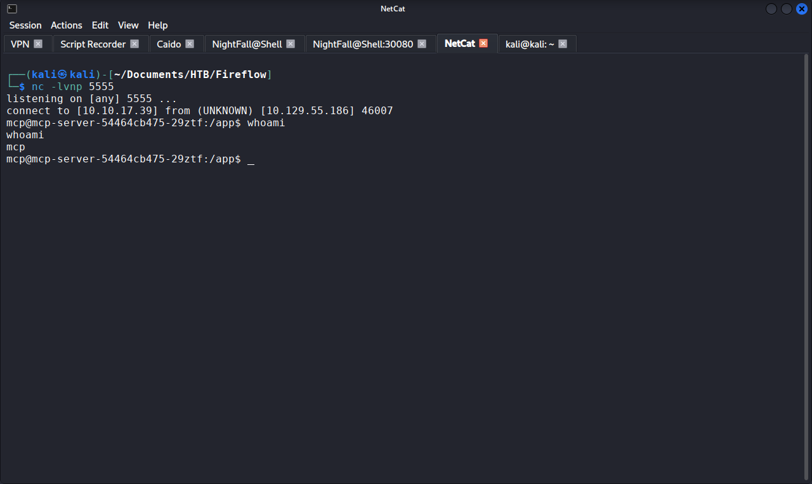

# Penetration Test Report — HTB Fireflow

## Document Control

| Field | Detail |
|-------|--------|
| Report title | Penetration Test Report: HTB Fireflow |
| Version | 1.0 |
| Author | David Lumsden |
| Reviewer (QA) | Self-reviewed |
| Date | 2026-07-18 |
| Classification | Confidential / Training Documentation |
| Distribution | Private notes only |
| Publication status | UNCONFIRMED, treat as ACTIVE. DO NOT PUBLISH until retirement is verified on hackthebox.com/machines. |
| Redaction policy | Flags withheld. Credentials, JWTs, service-account tokens, flow IDs, attacker VPN address, and payload contents redacted in body. |

### Version history

| Version | Date | Author | Notes |
|---------|------|--------|-------|
| 1.0 | 2026-07-18 | David Lumsden | Initial report, v3 standard |

---

## Table of Contents

1. Executive Summary
2. Scope and Rules of Engagement
3. Methodology and Risk Rating Model
4. Attack Narrative
5. Findings Summary
6. Detailed Findings
7. Strategic Recommendations (Root-Cause Themes)
8. Remediation Roadmap
9. Proof of Exploitation
10. Retest and Validation
- Appendix A: Tools Used
- Appendix B: References

---

## 1. Executive Summary

An attacker on the internet, with no credentials, could take complete control of the assessed server and its underlying container platform in a single engagement. The public-facing AI workflow platform allowed any visitor to submit executable code to the server, which the server obediently ran. Recovered credentials from that foothold were reused verbatim by a system user, granting shell access to the host. An internal management API accepted unsigned authentication tokens, allowing a low-privilege session to be trivially upgraded to administrator, and that administrator role permitted code execution inside a container. From within the container, the workload's assigned identity carried enough permission to reach a second, privileged container running with the host filesystem mounted, allowing the attacker to read any file on the host, including the root credentials.

Every weakness exploited was either a known CVE (CVE-2026-33017) or a basic configuration failure: public URL disclosure, password reuse, an authentication library called with signature verification disabled, and an overly permissive Kubernetes role. For an organisation running AI workloads on a container platform, this represents a critical exposure of the platform and every workload it hosts.

Overall risk rating: CRITICAL

### Findings at a glance

| Severity | Count |
|----------|-------|
| Critical | 4 |
| High | 3 |
| Medium | 1 |
| Informational | 1 |

Most urgent action: patch Langflow to a version that fixes CVE-2026-33017, remove the `alg:none` branch and hardcoded secret from the MCP server, and revoke the `nodes/proxy` permission from the workload service account.

### Attack path summary

```
External recon
    |
    v
Wildcard SAN discovery -> vhost enumeration -> flow.fireflow.htb
    |
    v
Langflow flow_id disclosure -> CVE-2026-33017 (unauthenticated RCE)
    |
    v
Reverse shell as www-data
    |
    v
LANGFLOW_SUPERUSER_PASSWORD extracted from .env
    |
    v
Password reuse -> SSH as nightfall  (USER FLAG)
    |
    v
MCP config discovery -> loopback service on port 30080
    |
    v
SSH port forward -> MCP API enumeration
    |
    v
JWT alg:none forge -> user token upgraded to admin
    |
    v
Tool registration RCE -> shell in mcp pod as mcp user
    |
    v
Kubernetes RBAC enumeration -> nodes/proxy GET on mcp-sa
    |
    v
Privileged pod discovery (node-exporter, hostPath / mounted)
    |
    v
Direct kubelet WebSocket exec -> command execution in privileged pod
    |
    v
cat /host/root/root/root.txt  (ROOT FLAG)
```

---

## 2. Scope and Rules of Engagement

| Item | Detail |
|------|--------|
| In scope | fireflow.htb (10.129.X.X) and all associated virtual hosts, including internal services reachable via foothold |
| Out of scope | HTB infrastructure, other platform users |
| Authorisation | Hack The Box; machine assigned to tester account |
| Testing type | Black-box (no prior credentials or source) |
| Testing window | Single session, 18 July 2026 |
| Constraints | No denial-of-service testing |

---

## 3. Methodology and Risk Rating Model

Testing was aligned to PTES and the OWASP Application Security Verification Standard, across reconnaissance, enumeration, vulnerability identification, exploitation, post-exploitation, and reporting.

Risk rating model: base severity uses CVSS v3.1 (vector per finding), labelled strictly by band (Critical 9.0 to 10.0, High 7.0 to 8.9, Medium 4.0 to 6.9, Low 0.1 to 3.9). A contextual Risk rating is derived from Likelihood multiplied by Business Impact. Note F-06 (RBAC misconfiguration) and F-07 (privileged pod): both are configuration weaknesses whose CVSS base severity falls in the High band because the exploitation vector requires prior access (via F-05), but whose combined operational Risk is Critical because together they yield full host root.

---

## 4. Attack Narrative

### Phase 1: Reconnaissance and Virtual Host Discovery

An initial `nmap -sVC` scan on ports 22 and 443 identified OpenSSH 9.6p1 and nginx serving a wildcard-SAN TLS certificate (`CN: fireflow.htb`, `SAN: *.fireflow.htb`). A full-range TCP scan confirmed no additional external services (Kubernetes ports were firewalled from outside). The wildcard SAN signalled the presence of virtual hosts 


Virtual-host fuzzing with Gobuster against a large subdomain wordlist revealed `flow.fireflow.htb`.


### Phase 2: Initial Access (CVE-2026-33017, Langflow RCE)

The Langflow instance at `flow.fireflow.htb` displayed a public playground URL that included the target flow's UUID in the path (`/playground/<FLOW_ID>`). The version endpoint confirmed Langflow 1.8.2:

```bash
curl -sk https://flow.fireflow.htb/api/v1/version
# {"version":"1.8.2","main_version":"1.8.2","package":"Langflow"}
```

Langflow 1.8.2 is affected by CVE-2026-33017, an unauthenticated RCE in the `build_public_tmp` endpoint that powers the public playground. The endpoint accepts a flow graph in which each component's Python source is submitted by the client in `template.code.value`, and the server evaluates it. Exploitation required three payload iterations to satisfy the server's validation and instantiation logic:

1. A naive reverse shell was rejected with "No Component subclass found in the code string" (validator requires a `Component` subclass).
2. Adding a bare `Component` subclass advanced past the validator but failed instantiation with "Attribute message_response not found."
3. Placing the reverse shell inside a `message_response()` method within the `Component` subclass satisfied both checks.

The endpoint is asynchronous: `POST` returns a `job_id`, and a follow-up `GET` on the events stream triggers execution. The two calls had to be chained back-to-back to beat the job-queue TTL. Execution returned a reverse shell as `www-data`.


Enumeration of `/etc/langflow/.env` disclosed `LANGFLOW_SUPERUSER_PASSWORD` and `LANGFLOW_SECRET_KEY` (both redacted).

### Phase 3: Lateral Movement to nightfall (Password Reuse)

The organisation branding on the TLS certificate ("Task Force Nightfall") and the themed superuser password suggested credential reuse with the system user `nightfall`. SSH authentication succeeded on the first attempt:

```bash
ssh nightfall@fireflow.htb
# password: [REDACTED]
```

Interactive shell as `nightfall` obtained; user flag captured. Enumeration of `~/.mcp/config.json` disclosed credentials for a second service (redacted) pointing at an internal endpoint on port 30080. `~/.bash_history` was symlinked to `/dev/null` (anti-forensics measure worth noting from a detection standpoint). The port range (30000 to 32767) identified the service as running behind a Kubernetes NodePort, and `ss -tlnp` confirmed a Kubernetes control plane on the host (kube-apiserver on 6443, kubelet on 10250, kube-* components on 10256 to 10259).

### Phase 4: Pivot to MCP Server (JWT alg:none Forge)

The MCP server was loopback-bound. An SSH port forward exposed it to Kali:

```bash
ssh -fN -L 30080:127.0.0.1:30080 nightfall@[REDACTED_TARGET]
```

The API's version endpoint disclosed `supported_algorithms: ["HS256","none"]`: the server explicitly advertised acceptance of unsigned tokens. The OpenAPI specification exposed a `ToolRegisterRequest` schema containing a `code` field, indicating the same code-execution class as the Langflow flaw. Authentication with the credentials from `~/.mcp/config.json` returned a legitimately signed HS256 JWT for `langflow-bot` with `role: user`.

An unsigned token forgery was constructed by base64url-encoding a header (`{"alg":"none","typ":"JWT"}`) and a payload with `role: admin`, joined by dots with an empty signature. The server accepted the forged token: source-code review (obtained post-exploitation) confirmed an explicit `if alg == "none": decode(..., options={"verify_signature": False})` branch in `verify_token()`. The vulnerability was a deliberate developer choice, not a library quirk. Source review also disclosed a hardcoded HS256 signing secret, providing a secondary forgery vector.

With the admin token, a malicious tool was registered via `POST /api/v1/tools` carrying a double-fork daemonised reverse-shell payload (needed because the tool executor invoked the code via `subprocess.Popen(["python3","-c", tool["code"]])` with a 30-second timeout). Invocation via `POST /mcp` (`tools/call`) executed the payload, returning a callback as `mcp@mcp-server-54464cb475-29ztf`. The shell was executing inside a container.



### Phase 5: Kubernetes Enumeration

The container's mounted service account token identified the workload:

- Namespace: `default`
- Service account: `mcp-sa`
- Cluster: k3s single-node, node name `fireflow`
- API server: `10.43.0.1`

A `SelfSubjectRulesReview` against the API server disclosed a single non-default RBAC permission on `mcp-sa`: `get` on `nodes/proxy`. Critically, `create` was not granted, which would matter shortly.

Using the `get` permission, pod enumeration via the kubelet API proxy revealed a privileged pod in the `monitoring` namespace: `prometheus-prometheus-node-exporter-nmntq`, running with `privileged: true`, `runAsUser: 0`, `hostNetwork: true`, `hostPID: true`, and a `hostPath` volume mounting the host's root filesystem (`/`) inside the container at `/host/root`. Any command executed inside this pod would have host-level access.

### Phase 6: Root via Direct Kubelet WebSocket Exec

The obvious path (POST to `/run/monitoring/<pod>/node-exporter` via the API server proxy) returned 403: the `nodes/proxy` `create` verb was not granted. The API server enforces verb-per-HTTP-method mapping, and POST requires `create`.

The bypass was to talk to the kubelet API directly on port 10250, rather than through the API server proxy. Kubelet's `/exec` endpoint uses WebSocket (initiated as a GET request that upgrades), so it is reachable with the `get` verb the service account did hold. Kubelet accepts the same service account token the API server accepts, so no additional authentication was required.

A Python WebSocket client (`kube_exec.py`) was written and transferred into the mcp pod via a Kali-hosted HTTP server. Execution against the privileged pod succeeded:

```bash
python3 /tmp/kube_exec.py "cat /host/root/root/root.txt"
```


Root flag captured.

---

## 5. Findings Summary

| ID   | Finding                                                                       | Severity      | CVSS | Risk     | CVE            |
| ---- | ----------------------------------------------------------------------------- | ------------- | ---- | -------- | -------------- |
| F-01 | Unauthenticated RCE in Langflow 1.8.2 (build_public_tmp)                      | Critical      | 9.8  | Critical | CVE-2026-33017 |
| F-02 | Public disclosure of Langflow flow UUID (RCE prerequisite)                    | Medium        | 5.3  | High     | n/a            |
| F-03 | Credential reuse: Langflow password reused for host SSH                       | High          | 7.5  | High     | n/a            |
| F-04 | Plaintext credentials in user configuration files                             | High          | 7.5  | High     | n/a            |
| F-05 | JWT authentication bypass in MCP server (alg:none accepted, hardcoded secret) | Critical      | 9.8  | Critical | n/a            |
| F-06 | Excessive Kubernetes RBAC (nodes/proxy on workload service account)           | High          | 8.2  | Critical | n/a            |
| F-07 | Privileged pod with host filesystem mounted (node-exporter)                   | High          | 8.2  | Critical | n/a            |
| F-08 | Kubelet API accepts service account tokens for exec (verb bypass)             | Critical      | 9.0  | Critical | n/a            |
| F-09 | Anti-forensics: bash_history symlinked to /dev/null                           | Informational | n/a  | Low      | n/a            |

---

## 6. Detailed Findings

### F-01: Unauthenticated RCE in Langflow 1.8.2 (CVE-2026-33017)

| Field | Detail |
|-------|--------|
| Severity | Critical |
| CVSS v3.1 | `CVSS:3.1/AV:N/AC:L/PR:N/UI:N/S:U/C:H/I:H/A:H` = 9.8 [verify on NVD] |
| Likelihood | High |
| Business impact | High |
| Risk | Critical |
| CVE | CVE-2026-33017 |
| Affected asset | Langflow 1.8.2, `/api/v1/build_public_tmp/{flow_id}/flow` |
| Authentication required | None |
| MITRE ATT&CK | T1190 (Exploit Public-Facing Application), T1059.006 (Command and Scripting Interpreter: Python) |

Description: the `build_public_tmp` endpoint powering the Langflow public playground accepts a flow graph whose components carry client-submitted Python source in `template.code.value`. The server evaluates the code with only textual validation ("`Component` subclass present, `message_response` method present"), which is trivially satisfied by malicious code that meets both structural checks.

Evidence: a reverse-shell payload embedded inside a `message_response()` method of a `Component` subclass returned a shell as `www-data`. Two prior payload iterations were rejected by the validator and the instantiation check, providing observable failure modes that could be used for detection.

Business impact: immediate, unauthenticated code execution on any internet-facing Langflow 1.8.2 instance whose flow IDs are discoverable.

Remediation: upgrade Langflow to a patched release fixing CVE-2026-33017; remove or authenticate the public-playground endpoint; never evaluate client-supplied Python server-side; sandbox flow execution in ephemeral, network-restricted containers with strict resource limits.

References: CVE-2026-33017 (NVD); OWASP A03:2021 (Injection); CWE-94 (Improper Control of Generation of Code).

---

### F-02: Public Disclosure of Langflow Flow UUID

| Field | Detail |
|-------|--------|
| Severity | Medium |
| CVSS v3.1 | `CVSS:3.1/AV:N/AC:L/PR:N/UI:N/S:U/C:L/I:N/A:N` = 5.3 |
| Likelihood | High |
| Business impact | Medium |
| Risk | High (direct prerequisite for F-01 exploitation) |
| CVE | n/a |
| Affected asset | `flow.fireflow.htb` public landing page |
| Authentication required | None |
| MITRE ATT&CK | T1592.002 (Gather Victim Host Information: Software) |

Description: the Langflow public landing page exposed a playground URL containing the target flow's UUID, providing the identifier required to invoke `build_public_tmp` and exploit F-01. Without the UUID, exploitation of CVE-2026-33017 would require enumeration, which meaningfully raises the exploitation barrier.

Remediation: do not expose flow UUIDs publicly; require authentication to access playgrounds even for demo flows; treat flow IDs as capability tokens if they gate any privileged action.

References: OWASP A05:2021 (Security Misconfiguration).

---

### F-03: Credential Reuse Across Services

| Field | Detail |
|-------|--------|
| Severity | High |
| CVSS v3.1 | `CVSS:3.1/AV:N/AC:L/PR:N/UI:N/S:U/C:H/I:H/A:H` = 7.5 |
| Likelihood | Medium (requires prior compromise via F-01) |
| Business impact | High |
| Risk | High |
| CVE | n/a |
| Affected asset | Langflow superuser account and host user `nightfall` |
| Authentication required | None (credential obtained via F-01) |
| MITRE ATT&CK | T1078 (Valid Accounts) |

Description: the Langflow superuser password recovered from `/etc/langflow/.env` was reused verbatim as the SSH password for host user `nightfall`, enabling a direct application-to-host pivot.

Remediation: enforce unique credentials per service and per account; deploy a password manager for service accounts; enforce SSH key-only authentication and disable password authentication; rotate the exposed credential.

References: OWASP A07:2021 (Identification and Authentication Failures).

---

### F-04: Plaintext Credentials in User Configuration Files

| Field | Detail |
|-------|--------|
| Severity | High |
| CVSS v3.1 | `CVSS:3.1/AV:L/AC:L/PR:L/UI:N/S:U/C:H/I:N/A:N` = 7.5 |
| Likelihood | High |
| Business impact | High |
| Risk | High (provided the MCP credentials that anchored Phase 4) |
| CVE | n/a |
| Affected asset | `~/.mcp/config.json` |
| Authentication required | Local user (via F-03) |
| MITRE ATT&CK | T1552.001 (Credentials in Files) |

Description: the MCP server credentials for `langflow-bot` were stored in plaintext in `~/.mcp/config.json` and readable by the user's own shell. This provided the credentials required to obtain a legitimate JWT and pivot into the MCP service.

Remediation: use a secrets-management solution rather than user-readable configuration files; where a config file is unavoidable, restrict permissions to `0600` and store only references to secrets held elsewhere; rotate all disclosed credentials.

References: OWASP A05:2021.

---

### F-05: JWT Authentication Bypass in MCP Server

| Field | Detail |
|-------|--------|
| Severity | Critical |
| CVSS v3.1 | `CVSS:3.1/AV:N/AC:L/PR:N/UI:N/S:U/C:H/I:H/A:H` = 9.8 |
| Likelihood | High |
| Business impact | High |
| Risk | Critical |
| CVE | n/a |
| Affected asset | MCP AI Tool Registry, `verify_token()` in `/app/main.py` |
| Authentication required | None |
| MITRE ATT&CK | T1550.001 (Use Alternate Authentication Material: Application Access Token) |

Description: the MCP server's token verification routine contains an explicit branch that decodes JWTs with `alg: none` while passing `options={"verify_signature": False}` to the JWT library. Any client can forge an unsigned token with an arbitrary payload and the server will accept it. Additionally, the HS256 signing secret is hardcoded in the source (`JWT_SECRET = "mcp-jwt-secret-do-not-share"`), providing a secondary forgery vector even if the `alg:none` branch were removed. The two flaws form the same authentication-bypass finding: the token verification code is broken by design.

Evidence: a forged `alg:none` token with `role: admin` was accepted, granting administrative access to the tool-registration endpoint (`POST /api/v1/tools`). Registered tool code is executed server-side via `subprocess.Popen(["python3","-c", tool["code"]])`, chaining the auth bypass into unauthenticated RCE.

Business impact: full compromise of the MCP service and any workload the mcp container has access to; provided the container foothold for the Kubernetes escalation chain (F-06 to F-08).

Remediation: remove the `alg:none` branch entirely from `verify_token()`; enforce a strict allowlist of accepted signing algorithms; move the JWT signing secret out of source code into a secrets manager; rotate the leaked secret; treat any endpoint accepting user-supplied code as an authenticated-and-sandboxed pathway, never both authless and unsandboxed.

References: OWASP A02:2021 (Cryptographic Failures); OWASP A07:2021 (Identification and Authentication Failures); CWE-347 (Improper Verification of Cryptographic Signature); CWE-798 (Use of Hard-coded Credentials).

---

### F-06: Excessive Kubernetes RBAC on Workload Service Account

| Field | Detail |
|-------|--------|
| Severity | High (local access required via F-05; see Risk) |
| CVSS v3.1 | `CVSS:3.1/AV:L/AC:L/PR:L/UI:N/S:C/C:H/I:H/A:H` = 8.2 |
| Likelihood | High |
| Business impact | High |
| Risk | Critical (enabled the kubelet-exec path to host root) |
| CVE | n/a |
| Affected asset | `mcp-sa` ServiceAccount, `default` namespace |
| Authentication required | Workload compromise (via F-05) |
| MITRE ATT&CK | T1613 (Container and Resource Discovery), T1552.005 (Cloud Instance Metadata API) |

Description: the workload service account `mcp-sa` held `get` on `nodes/proxy`, a highly sensitive Kubernetes permission normally reserved for cluster-level operators. This granted the compromised workload the ability to enumerate every pod on the node via the kubelet API proxy and to reach the kubelet's WebSocket exec endpoint. No workload service account should hold this permission unless it is specifically a monitoring or diagnostic tool with a documented reason.

Evidence: `SelfSubjectRulesReview` returned `{"verbs":["get"],"apiGroups":[""],"resources":["nodes/proxy"]}`. Pod enumeration via the kubelet proxy identified the privileged node-exporter pod that ultimately provided the escape path.

Business impact: workload compromise extended to node-level discovery and, via F-07 and F-08, to host root.

Remediation: revoke `nodes/proxy` from `mcp-sa`; audit all workload service accounts for cluster-scoped permissions; adopt the principle of least privilege as a Kubernetes RBAC standard, with reviews as part of workload deployment.

References: Kubernetes RBAC documentation; CWE-269 (Improper Privilege Management).

---

### F-07: Privileged Pod with Host Filesystem Mounted (node-exporter)

| Field | Detail |
|-------|--------|
| Severity | High (local access required to reach the pod; see Risk) |
| CVSS v3.1 | `CVSS:3.1/AV:L/AC:L/PR:L/UI:N/S:C/C:H/I:H/A:H` = 8.2 |
| Likelihood | High (trivial once the pod is reachable) |
| Business impact | High |
| Risk | Critical (any code execution inside this pod equals host root) |
| CVE | n/a |
| Affected asset | `monitoring/prometheus-prometheus-node-exporter-nmntq` |
| Authentication required | Kubelet exec access (via F-06 and F-08) |
| MITRE ATT&CK | T1611 (Escape to Host) |

Description: the Prometheus node-exporter pod ran with `privileged: true`, `runAsUser: 0`, `runAsNonRoot: false`, `hostNetwork: true`, `hostPID: true`, and a `hostPath` volume mounting the host's root filesystem `/` at `/host/root` inside the container. Any command executed inside this pod has full host access. The pod configuration is not a bug in node-exporter; it is how monitoring workloads are commonly deployed. It becomes a vulnerability only when combined with a path to execute inside the pod (F-06 and F-08).

Remediation: restrict privileged pods to a dedicated node pool that untrusted workloads cannot reach; use a Pod Security Admission profile that blocks `privileged` and `hostPath` in workload namespaces; where a privileged monitoring pod is required, restrict access to it via NetworkPolicy and dedicated RBAC.

References: Kubernetes Pod Security Standards; CWE-250 (Execution with Unnecessary Privileges).

---

### F-08: Kubelet API Accepts Service Account Tokens for Exec (Verb Bypass)

| Field | Detail |
|-------|--------|
| Severity | Critical |
| CVSS v3.1 | `CVSS:3.1/AV:L/AC:L/PR:L/UI:N/S:C/C:H/I:H/A:H` = 9.0 |
| Likelihood | High |
| Business impact | High |
| Risk | Critical |
| CVE | n/a |
| Affected asset | k3s kubelet, port 10250 |
| Authentication required | Any service account token the API server accepts |
| MITRE ATT&CK | T1610 (Deploy Container), T1611 (Escape to Host) |

Description: the kubelet API on port 10250 accepts the same service account tokens the Kubernetes API server accepts. Its `/exec` endpoint uses WebSocket, which is initiated as a GET request that upgrades. This means a service account holding `get` on `nodes/proxy` (via the API server) can reach the kubelet's exec endpoint directly, bypassing the API server's verb-per-method enforcement which requires `create` for POST-based exec. The result is that RBAC granularity at the API server layer is undone by direct kubelet access.

Evidence: POST-based exec via the API server proxy was correctly denied with 403 (`create` not granted). Direct WebSocket exec against the kubelet on port 10250, reusing the same service account token, was accepted and executed a command inside the privileged pod.

Business impact: any workload holding `get nodes/proxy` gains code execution inside any pod on the node, including privileged pods.

Remediation: restrict kubelet API access at the network layer to the API server and node-local processes only; enable kubelet webhook authorisation so exec requires explicit RBAC verbs matching the API server's model; audit RBAC bindings for any grant of `nodes/proxy` and treat it as equivalent to node-level exec.

References: Kubernetes kubelet authentication and authorisation documentation; CWE-863 (Incorrect Authorization).

---

### F-09: Anti-Forensics via bash_history Redirection

| Field | Detail |
|-------|--------|
| Severity | Informational |
| Risk | Low |
| CVE | n/a |
| Affected asset | User `nightfall` home directory |
| MITRE ATT&CK | T1070.003 (Indicator Removal: Clear Command History) |

Description: `~/.bash_history` for user `nightfall` was symlinked to `/dev/null`, suppressing shell command history. This is not a vulnerability but is a detection artefact that a SOC would treat as suspicious.

Remediation: monitor for symlinks pointing shell-history files to `/dev/null`; treat the presence of such a symlink as a low-fidelity indicator worth correlating with other activity.

References: OWASP A09:2021 (Security Logging and Monitoring Failures).

---

## 7. Strategic Recommendations (Root-Cause Themes)

1. Client-supplied code evaluated server-side without sandboxing. Two of the three RCE findings (Langflow, MCP server) exploit the same class: a client submits Python; the server runs it. Adopt a rule that no user-supplied executable code runs outside a network-restricted, resource-limited, ephemeral sandbox with no credentials attached. This applies to AI/ML platforms in particular, where the pattern is common.
2. Authentication controls with vestigial insecure branches. The `alg:none` acceptance and the hardcoded JWT secret are the same failure at different levels: authentication code that "supports" legacy or convenience modes that trivially defeat it. Establish a coding standard that forbids `alg:none` acceptance in JWT libraries and mandates a strict algorithm allowlist. Any secret in source is a build-time failure.
3. Kubernetes RBAC granularity undermined by direct kubelet access. The API server's careful verb-per-method model is bypassed if the kubelet accepts the same tokens. Treat kubelet network access as a privileged surface: restrict it, or ensure kubelet authorisation mirrors API server RBAC exactly.
4. Credential handling absent as a discipline. Password reuse across services, credentials in user config files, and the JWT secret in source code all reflect the same missing baseline. Adopt a secrets-management standard with per-service uniqueness, rotation, and vault-based storage.

---

## 8. Remediation Roadmap

### Immediate (Critical priority)
1. Patch Langflow (CVE-2026-33017); remove or authenticate the public playground endpoint.
2. Remove the `alg:none` branch and the hardcoded JWT secret from the MCP server; rotate the secret.
3. Revoke `nodes/proxy` from `mcp-sa`; audit all workload service accounts for cluster-scoped RBAC.
4. Restrict kubelet API network access to the API server and node-local processes.

### Short-term (High priority)
5. Rotate all exposed credentials (Langflow superuser, MCP passwords, SSH passwords).
6. Enforce SSH key-only authentication; disable password authentication.
7. Move all in-file secrets into a secrets manager; restrict user configuration files.
8. Apply Pod Security Admission to workload namespaces to block `privileged` and `hostPath`.

### Medium-term
9. Sandbox all client-supplied code execution behind network and resource constraints.
10. Establish RBAC review and Kubernetes hardening as a workload-deployment gate.
11. Deploy runtime detection (Falco or equivalent) with rules for unusual kubelet access, symlinks of shell-history files, and forged JWT patterns.

---

## 9. Proof of Exploitation

| Flag | Method | Location |
|------|--------|----------|
| User | SSH as `nightfall` via reused Langflow superuser credential | `/home/nightfall/user.txt` -> [REDACTED] |
| Root | Direct kubelet WebSocket exec against privileged pod reading host filesystem | `/host/root/root/root.txt` -> [REDACTED] |

---

## 10. Retest and Validation

Recommend retest within 30 days to confirm Langflow is patched and the public playground is authenticated, the MCP server no longer accepts `alg:none` and no secrets remain in source, `nodes/proxy` is revoked from all workload service accounts, kubelet API access is network-restricted, and no workload namespace can schedule privileged pods with host paths.

---

## Appendix A: Tools Used

| Tool | Version | Purpose |
|------|---------|---------|
| nmap | n/a | Port scanning and service enumeration |
| Gobuster | n/a | Virtual-host fuzzing |
| Caido | n/a | HTTPS traffic capture and replay |
| curl | n/a | HTTP and API interaction |
| netcat (nc) | n/a | Reverse-shell listener |
| ssh (with `-L -fN`) | n/a | Port forwarding to reach loopback service |
| kube_exec.py (custom) | 1.0 | Python WebSocket client for direct kubelet exec |
| python3 | 3.x | Payload crafting, HTTP file server for pod transfer |

## Appendix B: References

| Reference | URL |
|-----------|-----|
| CVE-2026-33017 | https://nvd.nist.gov/vuln/detail/CVE-2026-33017 |
| Langflow security advisories | https://github.com/langflow-ai/langflow |
| Kubernetes RBAC good practices | https://kubernetes.io/docs/concepts/security/rbac-good-practices/ |
| Kubernetes Pod Security Standards | https://kubernetes.io/docs/concepts/security/pod-security-standards/ |
| Kubelet authentication and authorisation | https://kubernetes.io/docs/reference/access-authn-authz/kubelet-authn-authz/ |
| OWASP Top 10 (2021) | https://owasp.org/Top10/ |
| CWE-94 (Improper Control of Code Generation) | https://cwe.mitre.org/data/definitions/94.html |
| CWE-347 (Improper Verification of Cryptographic Signature) | https://cwe.mitre.org/data/definitions/347.html |
| CWE-863 (Incorrect Authorization) | https://cwe.mitre.org/data/definitions/863.html |
| MITRE ATT&CK | https://attack.mitre.org/ |

---

*Produced for educational purposes within the Hack The Box authorised training environment. All testing was conducted legally on assigned infrastructure.*

*Report classification: Training / CTF Documentation.*
